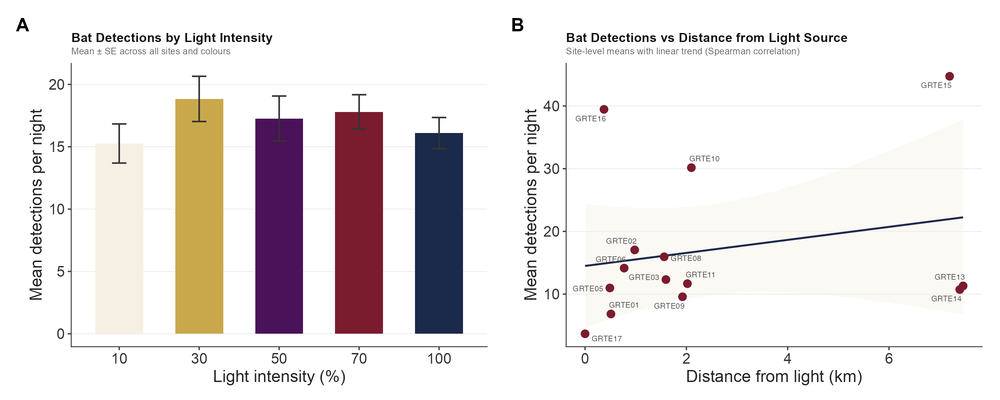
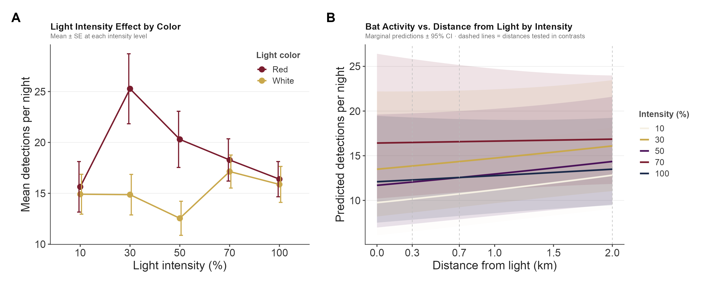
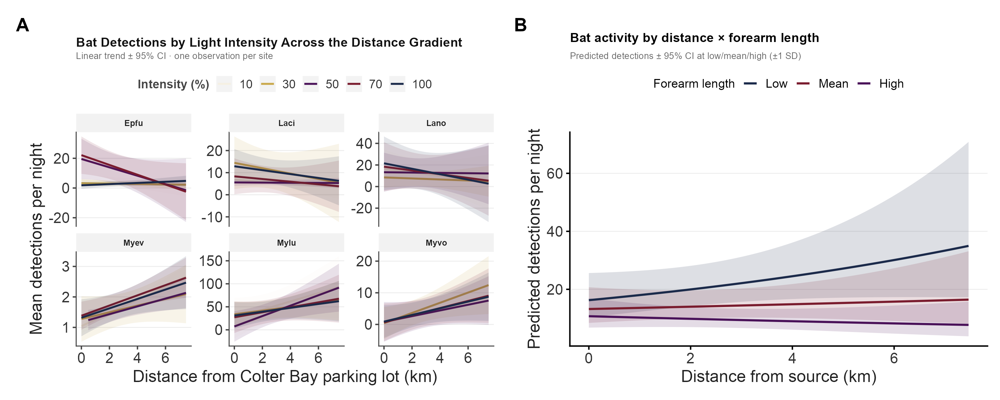
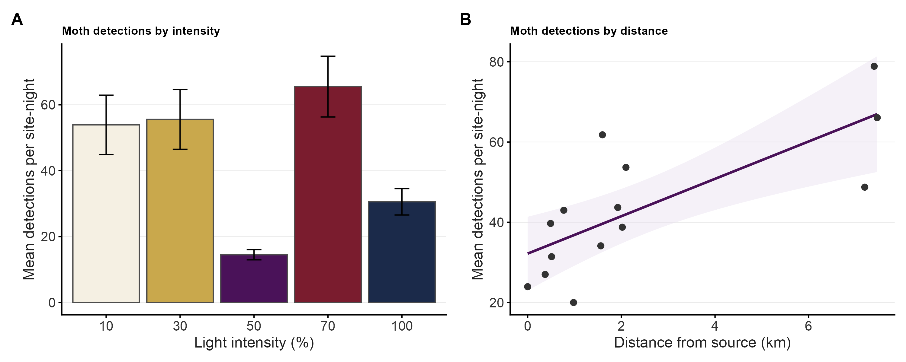
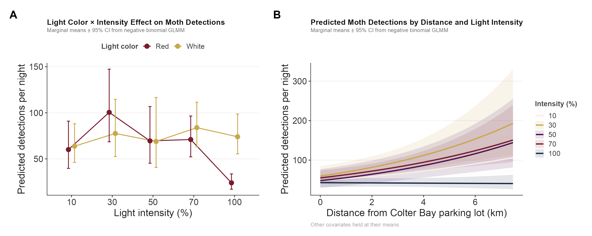
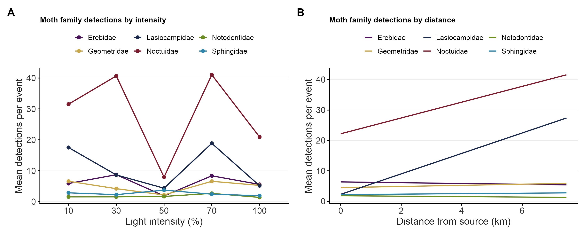
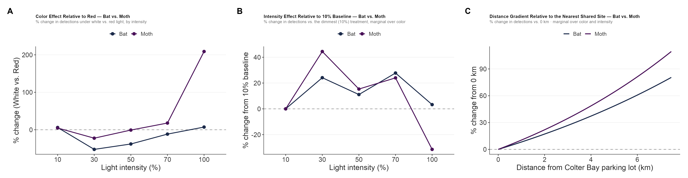
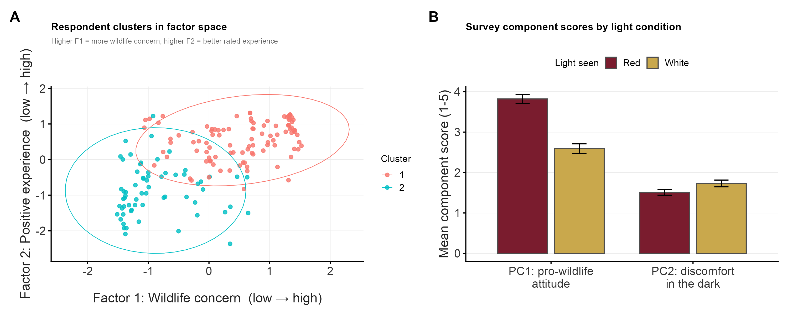

```{r setup, include=FALSE}
library(tidyverse)

# Shared theme + palette (matches ColterBay style)
bat_theme <- theme_classic(base_size = 15, base_family = "Arial") +
  theme(
    plot.background    = element_rect(fill = "white", color = NA),
    panel.background   = element_rect(fill = "white", color = NA),
    panel.grid.major.y = element_line(color = "#EBEBEB", linewidth = 0.4),
    panel.grid.major.x = element_blank(),
    axis.line          = element_line(color = "#444444", linewidth = 0.5),
    axis.ticks         = element_line(color = "#444444"),
    axis.text          = element_text(color = "#333333", size = 16),
    axis.title         = element_text(color = "#222222", size = 18),
    plot.title         = element_text(color = "#111111", size = 14,
                                      face = "bold", margin = margin(b = 3)),
    plot.subtitle      = element_text(color = "#666666", size = 10,
                                      margin = margin(b = 8)),
    legend.background  = element_rect(fill = "white", color = NA),
    legend.key         = element_rect(fill = "white", color = NA),
    legend.text        = element_text(color = "#333333", size = 10),
    legend.title       = element_text(color = "#444444", size = 9, face = "bold"),
    strip.background   = element_rect(fill = "#F2F2F2", color = NA),
    strip.text         = element_text(color = "#222222", face = "bold", size = 10),
    plot.caption       = element_text(color = "#999999", size = 8,
                                      hjust = 0, margin = margin(t = 8)),
    plot.margin        = margin(12, 14, 10, 12)
  )

col_red    <- "#7A1C2E"   
col_white  <- "#C9A84C"   
col_navy   <- "#1B2A4A"   
col_purple <- "#4A1259"   
col_ivory  <- "#F5F0E3"   

intensity_pal <- c("10"  = col_ivory,
                   "30"  = col_white,
                   "50"  = col_purple,
                   "70"  = col_red,
                   "100" = col_navy)
```

## Data Pipeline

```{r import, warning=FALSE, message=TRUE}
source("R/01_import_sonobat.R")
```

```{r clean, warning=FALSE, message=FALSE}
source("R/02_clean_data.R")
data <- clean_data(data_raw)
```

```{r habitat, warning=FALSE, message=FALSE}
source("R/03_extract_habitat.R")

data_env <- add_habitat(
  data,
  forest_raster = nlcd_forest,
  buffer = 50
)

data_env <- add_moonlight(data_env)
```

```{r treatment, warning=FALSE, message=FALSE}
source("R/07_add_light_treatment.R")

data_env <- data_env %>%
  left_join(
    lighting %>% select(date, color, intensity),
    by = "date"
  ) %>%
  mutate(
    color     = factor(color),
    site      = factor(site),
    intensity = factor(intensity)
  )

```

```{r distance, warning=FALSE, message=FALSE}
library(sf)

ref_point <- st_as_sf(
  data.frame(lon = -110.645134, lat = 43.904879),
  coords = c("lon", "lat"),
  crs = 4326
)

sites_sf <- st_as_sf(sites, coords = c("lon", "lat"), crs = 4326)
sites_sf <- st_transform(sites_sf, 32612)
ref_point <- st_transform(ref_point, 32612)

sites_sf$dist_m <- as.numeric(st_distance(sites_sf, ref_point))

# Pull only dist_m 
site_dists <- as.data.frame(sites_sf) %>% dplyr::select(site, dist_m)

data_env <- data_env %>%
  left_join(site_dists, by = "site") %>%
  mutate(
    dist_km = dist_m / 1000,
    dist_cat = case_when(
      dist_km < 0.52 ~ "Close",
      dist_km < 1    ~ "Medium",
      dist_km < 2.1  ~ "Further",
      TRUE           ~ "Far"
    ),
    jd_c = jd - mean(jd, na.rm = TRUE)   # centered Julian day
  )

data_env <- data_env %>% filter(!is.na(dist_km))

data_env %>% select(site, dist_km) %>% distinct() %>% arrange(dist_km)

# Reclassify out-of-region misidentifications onto the correct regional species,
# INCLUDING inside compound labels: Labo (Eastern red bat) -> Mylu and Myse
# (N. long-eared) -> Myev, neither of which occurs in the Grand Teton fauna
# (see R/38_species_checklist.R). Token-wise replacement; duplicate candidates
# that result are collapsed while preserving vote order, so e.g. "Mylu/Labo" ->
# "Mylu" (becomes a single-species call) and "Lano/Myse/Mylu" -> "Lano/Myev/Mylu".
.fix_aliases <- function(x) {
  vapply(stringr::str_split(x, "/"), function(toks) {
    toks <- dplyr::recode(toks, Labo = "Mylu", Myse = "Myev")
    paste(toks[!duplicated(toks)], collapse = "/")
  }, character(1))
}
data_env <- data_env %>% mutate(species = .fix_aliases(species))

# Merging can put two rows on the same species at the same site/date/recording;
# sum detections so counts stay additive and re-derive mean confidence.
.recode_key <- c("site", "year", "date", "jd", "jd2", "species",
                 "datetime", "time_sec")
data_env <- data_env %>%
  group_by(across(all_of(.recode_key))) %>%
  summarise(detections          = sum(detections),
            weighted_detections = sum(weighted_detections),
            across(-c(detections, weighted_detections, mean_confidence), first),
            .groups = "drop") %>%
  mutate(mean_confidence = weighted_detections / detections)

# Focal single-species set for the per-species and community models.
focal_spp <- c("Epfu", "Laci", "Lano", "Myca", "Myci",
               "Mylu", "Myvo", "Myyu", "Myth", "Myev")

# Acoustic guilds by call frequency. These partition the 10 focal species and
# are reused by the guild-cluster models below. A label joins a guild only if
# EVERY candidate species in it belongs to that guild.
lowfreq_spp  <- c("Epfu", "Lano", "Laci")                  # low frequency
medfreq_spp  <- c("Myev", "Myth")                          # medium frequency
highfreq_spp <- c("Mylu", "Myvo", "Myci", "Myca", "Myyu")  # high frequency
assign_cluster <- function(x) {
  vapply(stringr::str_split(x, "/"), function(toks) {
    if (all(toks %in% lowfreq_spp))       "LowFreq"
    else if (all(toks %in% medfreq_spp))  "MedFreq"
    else if (all(toks %in% highfreq_spp)) "HighFreq"
    else NA_character_
  }, character(1))
}

# Overall stream = focal single species + compounds that fall within ONE guild.
# Cross-guild compounds (e.g. Mylu/Myev, Anpa/Epfu) and non-focal singles are
# dropped, so the kept compounds match the guild definitions and the overall
# total equals the sum of the three guilds. Report what gets dropped.
.dropped <- data_env %>%
  filter(is.na(assign_cluster(species))) %>%
  mutate(kind = ifelse(str_detect(species, "/"),
                       "cross-guild compound", "non-focal single")) %>%
  group_by(kind) %>%
  summarise(labels = n_distinct(species), detections = sum(detections),
            .groups = "drop")
message("Dropped (not within a single guild): ",
        paste(sprintf("%s = %d detections (%d labels)",
                      .dropped$kind, .dropped$detections, .dropped$labels),
              collapse = " | "))

data_env <- data_env %>% filter(!is.na(assign_cluster(species)))

message("Overall data rows: ", nrow(data_env),
        "  |  single-species detections: ",
        sum(data_env$detections[!str_detect(data_env$species, "/")]),
        "  |  within-guild compound labels: ",
        n_distinct(data_env$species[str_detect(data_env$species, "/")]),
        " (", sum(data_env$detections[str_detect(data_env$species, "/")]),
        " detections)")
```

```{r sky_brightness, warning=FALSE, message=TRUE}
source("R/09_add_sky_brightness.R")
```

```{r bat_traits, warning=FALSE, message=FALSE}
library(readxl)

bat_traits <- read_excel("data/bat_traits.xlsx") %>%
  rename(species = Species)

data_env <- data_env %>%
  left_join(bat_traits, by = "species")

# Single-species subset for the per-species and community models. Compound
# (multi-species) labels are excluded here but remain in `data_env` for the
# overall model and figures.
data_env_focal <- data_env %>% filter(species %in% focal_spp)

# Per-site-night totals: bat activity = sum of detections across every species /
# compound label on a site-night. The site-night is the unit the light treatment
# is applied to, so the OVERALL model and the pooled figures (R/08) both use this.
# Every covariate is constant within a site-night, so nothing is lost aggregating.
site_night <- data_env %>%
  group_by(site, date) %>%
  summarise(
    total_det       = sum(detections, na.rm = TRUE),
    color           = first(color),
    intensity       = first(intensity),
    dist_km         = first(dist_km),
    mean_phase      = first(mean_phase),
    pct_nonforest   = first(pct_nonforest),
    brightness_dark = first(brightness_dark),
    jd              = first(jd),
    jd_c            = first(jd_c),
    .groups = "drop"
  )
```

## Species Detection Counts

```{r species_counts, warning=FALSE, message=FALSE, fig.width=8, fig.height=5}
# Total detections per species (compound multi-species labels pooled into one bar)
spp_counts <- data_env %>%
  mutate(grp = ifelse(str_detect(species, "/"), "(compound)", species)) %>%
  group_by(grp) %>%
  summarise(detections = sum(detections), .groups = "drop") %>%
  mutate(grp = fct_reorder(grp, detections))

fig_spp_det <- ggplot(spp_counts, aes(detections, grp)) +
  geom_col(fill = col_navy, width = 0.75) +
  geom_text(aes(label = scales::comma(detections)),
            hjust = -0.1, size = 3.5, color = "#333333") +
  scale_x_continuous(expand = expansion(mult = c(0, 0.18)),
                     labels = scales::comma) +
  labs(title = "Total detections per species",
       subtitle = "SonoBat v30.1, Prob >= 0.9; compound (multi-species) labels pooled",
       x = "Total detections", y = NULL) +
  bat_theme

fig_spp_det

# Prevalence: how many of the sampled site-nights each focal species appears on
spp_prev <- data_env_focal %>%
  distinct(species, site, date) %>%
  count(species, name = "site_nights") %>%
  mutate(species = fct_reorder(species, site_nights))

fig_spp_prev <- ggplot(spp_prev, aes(site_nights, species)) +
  geom_col(fill = col_purple, width = 0.75) +
  geom_text(aes(label = site_nights), hjust = -0.15, size = 3.5, color = "#333333") +
  scale_x_continuous(expand = expansion(mult = c(0, 0.12))) +
  labs(title = "Site-nights each species was detected",
       subtitle = paste0("Out of ", n_distinct(paste(data_env$site, data_env$date)),
                         " sampled site-nights (focal species)"),
       x = "Site-nights with at least one detection", y = NULL) +
  bat_theme

fig_spp_prev

dir.create("output/figures", showWarnings = FALSE, recursive = TRUE)
ggsave("output/figures/species_counts.png", fig_spp_det,
       width = 8, height = 5, dpi = 200, bg = "white")
ggsave("output/figures/species_prevalence.png", fig_spp_prev,
       width = 8, height = 5, dpi = 200, bg = "white")
```

## Models

### Overall activity model (total detections per night)

```{r simple_model, warning=FALSE, message=FALSE}
library(glmmTMB)

# Overall activity model at the site-night level (one row per site x night).
# Total detections per night ~ treatment + covariates, with a site random effect.
# No ziformula: nightly totals have no structural zeros.
simple_model1 <- glmmTMB(
  total_det ~
    color * intensity +
    dist_km +
    mean_phase +
    pct_nonforest +
    brightness_dark +
    jd_c + I(jd_c^2) +
    (1 | site),
  data   = site_night,
  family = nbinom2()
)

summary(simple_model1)
```

## Guild-cluster models

Rather than forcing ambiguous compound calls onto a single species, group every detection into the acoustic guild the classifier is confident about, by call frequency: **low** (Epfu / Lano / Laci), **medium** (Myev / Myth), and **high** (Mylu / Myvo / Myci / Myca / Myyu). A detection joins a guild only if *every* candidate species in its label belongs to that guild. Cross-guild compounds and non-focal singles (\~2.6% of detections) were already excluded in the data pipeline above, so `data_env` holds only within-guild labels and the three guilds sum to the overall total. This models activity at the level SonoBat can actually resolve and it separates guilds that respond to distance differently (low-frequency activity concentrates near the lit parking lot, while the medium- and high-frequency guilds are more active farther out), which a pooled total would cancel out.

```{r cluster_setup, warning=FALSE, message=FALSE}
# `assign_cluster` and the guild sets (lowfreq_spp / medfreq_spp / highfreq_spp)
# are defined in the data pipeline above, where data_env was already restricted
# to within-guild labels -- so every row here assigns to a guild.
cl_det <- data_env %>%
  mutate(cluster = assign_cluster(species)) %>%
  group_by(site, date, cluster) %>%
  summarise(detections = sum(detections), .groups = "drop")

# zero-filled: every sampled site-night x guild, carrying site-night covariates
cluster_night <- site_night %>%
  select(site, date, color, intensity, dist_km, mean_phase,
         pct_nonforest, brightness_dark, jd_c) %>%
  tidyr::crossing(cluster = c("LowFreq", "MedFreq", "HighFreq")) %>%
  left_join(cl_det, by = c("site", "date", "cluster")) %>%
  mutate(detections = tidyr::replace_na(detections, 0),
         site = factor(site),
         cluster = factor(cluster, levels = c("LowFreq", "MedFreq", "HighFreq")))

# guild x colour x intensity, plus a guild-specific distance slope
cluster_glmm <- glmmTMB(
  detections ~ cluster * intensity + cluster * dist_km + color +
    mean_phase + pct_nonforest + brightness_dark + jd_c + I(jd_c^2) +
    (1 | site),
  data      = cluster_night,
  ziformula = ~1,
  family    = nbinom2()
)

summary(cluster_glmm)

# guild-specific distance slopes (log scale)
emmeans::emtrends(cluster_glmm, ~ cluster, var = "dist_km")
```

### Guild responses to intensity × color and to distance

```{r cluster_figs, warning=FALSE, message=FALSE, fig.width=13, fig.height=5}
library(emmeans)

# (1) intensity x color by guild
emm_cl <- as.data.frame(
  emmeans(cluster_glmm, ~ color * intensity | cluster, type = "response"))
names(emm_cl)[names(emm_cl) %in% c("response", "rate", "emmean")] <- "est"
pd <- position_dodge(0.35)
fig_cluster_ic <- ggplot(
    emm_cl, aes(factor(intensity), est, color = color, group = color)) +
  geom_line(linewidth = 0.9, position = pd) +
  geom_point(size = 2.5, position = pd) +
  geom_errorbar(aes(ymin = asymp.LCL, ymax = asymp.UCL),
                width = 0.2, linewidth = 0.7, position = pd) +
  scale_color_manual(values = c(R = col_red, W = col_white),
                     labels = c(R = "Red", W = "White"), name = "Light color") +
  facet_wrap(~ cluster, scales = "free_y") +
  labs(title = "Guild response to intensity × color",
       subtitle = "Predicted detections/night ± 95% CI",
       x = "Light intensity (%)", y = "Predicted detections / night") +
  bat_theme

# (2) distance response by guild (other covariates at their means, at 50% red)
dgrid <- expand.grid(
  dist_km   = seq(min(cluster_night$dist_km), max(cluster_night$dist_km), length = 60),
  cluster   = factor(c("LowFreq", "MedFreq", "HighFreq"), levels = levels(cluster_night$cluster)),
  color     = factor("R",  levels = levels(cluster_night$color)),
  intensity = factor("50", levels = levels(cluster_night$intensity)),
  jd_c = 0,
  mean_phase      = mean(cluster_night$mean_phase, na.rm = TRUE),
  pct_nonforest   = mean(cluster_night$pct_nonforest, na.rm = TRUE),
  brightness_dark = mean(cluster_night$brightness_dark, na.rm = TRUE),
  site = NA)
pr <- predict(cluster_glmm, newdata = dgrid, se.fit = TRUE, re.form = NA, type = "link")
dgrid$fit <- exp(pr$fit)
dgrid$lo  <- exp(pr$fit - 1.96 * pr$se.fit)
dgrid$hi  <- exp(pr$fit + 1.96 * pr$se.fit)
fig_cluster_dist <- ggplot(dgrid, aes(dist_km, fit, color = cluster, fill = cluster)) +
  geom_ribbon(aes(ymin = lo, ymax = hi), alpha = 0.15, color = NA) +
  geom_line(linewidth = 1.1) +
  scale_color_manual(values = c(LowFreq = col_navy, MedFreq = col_purple, HighFreq = col_red), name = NULL) +
  scale_fill_manual(values = c(LowFreq = col_navy, MedFreq = col_purple, HighFreq = col_red), guide = "none") +
  scale_y_log10() +   # guilds span ~2 orders of magnitude; log keeps all slopes visible
  labs(title = "Guild response to distance",
       subtitle = "Predicted detections/night ± 95% CI (at 50% red, other covariates at means); log scale",
       x = "Distance from Colter Bay parking lot (km)",
       y = "Predicted detections / night (log)") +
  bat_theme

fig_cluster_ic
fig_cluster_dist

ggsave("output/figures/cluster_intensity_color.png", fig_cluster_ic,
       width = 11, height = 5, dpi = 200, bg = "white")
ggsave("output/figures/cluster_distance.png", fig_cluster_dist,
       width = 8, height = 5, dpi = 200, bg = "white")
```

## Species models

### Community-average species model (hierarchical)

Total detections are \~68% `Mylu`, so a pooled total mostly reflects one species. This model instead keeps one row per site-night **× focal species** (with zeros filled in for species not detected that night) and enters species as a random effect, so the fixed effects estimate the **community-average** light response rather than a `Mylu`-weighted total. The zero-filled cells (\~39%) make the zero-inflated NB appropriate.

```{r species_glmm, warning=FALSE, message=FALSE}
library(glmmTMB)

# focal single-species detections summed to the site-night level
spp_det <- data_env_focal %>%
  group_by(site, date, species) %>%
  summarise(detections = sum(detections), .groups = "drop")

# zero-filled grid: every sampled site-night x focal species (0 where undetected),
# carrying the site-night covariates from `site_night`
spp_night <- site_night %>%
  select(site, date, color, intensity, dist_km, mean_phase,
         pct_nonforest, brightness_dark, jd_c) %>%
  tidyr::crossing(species = focal_spp) %>%
  left_join(spp_det, by = c("site", "date", "species")) %>%
  mutate(detections = tidyr::replace_na(detections, 0),
         site    = factor(site),
         species = factor(species))

# Random intercepts for site and species. (A per-species colour slope,
# (1 + color | species), was singular here, so intercepts only.)
species_glmm <- glmmTMB(
  detections ~
    color * intensity +
    dist_km +
    mean_phase +
    pct_nonforest +
    brightness_dark +
    jd_c + I(jd_c^2) +
    (1 | site) + (1 | species),
  data      = spp_night,
  ziformula = ~1,
  family    = nbinom2()
)

summary(species_glmm)
```

### Model-based intensity × color effects

Figure-3-style effect plots, but from the fitted models: predicted response by light intensity and colour with 95% CIs (estimated marginal means, other covariates held at their means, averaged over the random effects).

```{r model_effect_figs, warning=FALSE, message=FALSE, fig.width=8, fig.height=9}
library(emmeans)
library(patchwork)

# predicted response by intensity x color (+/- 95% CI), in the Fig 3 style
emm_intensity_color <- function(model, ttl, sub, ylab) {
  pd <- position_dodge(0.3)
  e  <- as.data.frame(emmeans(model, ~ color * intensity, type = "response"))
  names(e)[names(e) %in% c("response", "rate", "emmean")] <- "est"
  ggplot(e, aes(factor(intensity), est, color = color, group = color)) +
    geom_line(linewidth = 1, position = pd) +
    geom_point(size = 3, position = pd) +
    geom_errorbar(aes(ymin = asymp.LCL, ymax = asymp.UCL),
                  width = 0.15, linewidth = 0.8, position = pd) +
    scale_color_manual(values = c(R = col_red, W = col_white),
                       labels = c(R = "Red", W = "White"), name = "Light color") +
    labs(title = ttl, subtitle = sub, x = "Light intensity (%)", y = ylab) +
    bat_theme
}

fig_eff_species <- emm_intensity_color(
  species_glmm, "Community-average species response",
  "Model-based EMM +/- 95% CI (species_glmm)",
  "Predicted detections / species / night")

fig_eff_total <- emm_intensity_color(
  simple_model1, "Overall nightly activity",
  "Model-based EMM +/- 95% CI (simple_model1)",
  "Predicted total detections / night")

fig_eff_species / fig_eff_total

ggsave("output/figures/model_intensity_color.png",
       fig_eff_species / fig_eff_total,
       width = 8, height = 9, dpi = 200, bg = "white")
```

### Per-species intensity × color effects

Each species gets its own **intensity** response, with a **common** colour effect. Likelihood-ratio tests show species differ strongly in their intensity response (species × intensity, p \< 1e-16) but *not* in their colour response (species × colour, p = 0.43), and the full species × colour × intensity three-way is not worth its parameters (AIC and BIC both prefer dropping it). So we use `species * intensity + colour * intensity` — supported, better-fitting, and interpretable without a three-way. The red-vs-white gap is therefore consistent across species; the panels differ in their intensity shapes.

```{r model_effect_byspecies, warning=FALSE, message=FALSE, fig.width=13, fig.height=6.5}
library(emmeans)

# species-specific intensity response + a common colour x intensity effect
# (the 3-way species:color:intensity was significant but AIC/BIC-worse, and
# species:color was n.s.); same zero-filled grid as species_glmm
species_glmm_int <- glmmTMB(
  detections ~ species * intensity + color * intensity +
    dist_km + mean_phase + pct_nonforest + brightness_dark + jd_c + I(jd_c^2) +
    (1 | site),
  data      = spp_night,
  ziformula = ~1,
  family    = nbinom2()
)

emm_sp <- as.data.frame(
  emmeans(species_glmm_int, ~ color * intensity | species, type = "response"))
names(emm_sp)[names(emm_sp) %in% c("response", "rate", "emmean")] <- "est"

pd <- position_dodge(0.4)
fig_eff_byspecies <- ggplot(
    emm_sp, aes(factor(intensity), est, color = color, group = color)) +
  geom_line(linewidth = 0.8, position = pd) +
  geom_point(size = 2, position = pd) +
  geom_errorbar(aes(ymin = asymp.LCL, ymax = asymp.UCL),
                width = 0.2, linewidth = 0.6, position = pd) +
  scale_color_manual(values = c(R = col_red, W = col_white),
                     labels = c(R = "Red", W = "White"), name = "Light color") +
  facet_wrap(~ species, scales = "free_y", nrow = 2) +
  labs(title = "Per-species intensity effect, with a common colour effect (model-based)",
       subtitle = "Predicted detections/night ± 95% CI; species × intensity + colour × intensity (no 3-way); y-axes free",
       x = "Light intensity (%)", y = "Predicted detections / night") +
  bat_theme

fig_eff_byspecies

ggsave("output/figures/model_intensity_color_byspecies.png", fig_eff_byspecies,
       width = 13, height = 6.5, dpi = 200, bg = "white")
```

### Per-species distance response

Model-predicted detections across the distance gradient for each focal species, from the same zero-filled `spp_night` grid, now with a `species × dist_km` interaction (a common colour and intensity effect). **Caveat:** unlike the moth distance figures, the bat distance signal is fragile — it hinges on the three far (\~7 km) sites and GRTE15 in particular (see the robustness section), so read these as a near-vs-far *sort* (low-frequency bats near, Myotis far), not firm per-species slopes.

```{r species_distance, warning=FALSE, message=FALSE, fig.width=12, fig.height=6}
bat_spp_dist_glmm <- glmmTMB(
  detections ~ species * dist_km + color + intensity + mean_phase +
    pct_nonforest + brightness_dark + jd_c + I(jd_c^2) + (1 | site),
  data = spp_night, ziformula = ~1, family = nbinom2())

cat("=== Per-species distance slope (log detections / km) ===\n")
print(as.data.frame(emtrends(bat_spp_dist_glmm, ~ species, var = "dist_km")) %>%
        transmute(species, slope = round(dist_km.trend, 2), SE = round(SE, 2)))

dist_grid <- seq(min(spp_night$dist_km), max(spp_night$dist_km), length.out = 80)
bat_spp_pred <- as.data.frame(
  emmeans(bat_spp_dist_glmm, ~ species | dist_km,
          at = list(dist_km = dist_grid), type = "response")) %>%
  rename(lower = asymp.LCL, upper = asymp.UCL) %>%
  mutate(species = factor(species, levels = focal_spp))

fig_bat_species_distance <- ggplot(bat_spp_pred, aes(dist_km, response)) +
  geom_ribbon(aes(ymin = lower, ymax = upper), fill = col_navy, alpha = 0.15) +
  geom_line(color = col_navy, linewidth = 1) +
  facet_wrap(~ species, scales = "free_y", nrow = 2) +
  labs(title = "Predicted Bat Detections Across Distance, by Species",
       subtitle = "Model-estimated marginal means ± 95% CI (negative-binomial GLMM)",
       x = "Distance from parking lot (km)",
       y = "Predicted detections per site-night") +
  bat_theme
fig_bat_species_distance

ggsave("output/figures/bat_species_distance_panels.png", fig_bat_species_distance,
       width = 12, height = 6, dpi = 300, bg = "white")

bat_spp_pal <- setNames(
  c("#1B2A4A","#7A1C2E","#C9A84C","#4A1259","#2E7D5B","#B5651D",
    "#3B6EA5","#9C3848","#6B8E23","#7A5195"), focal_spp)
fig_bat_species_distance_combined <- ggplot(bat_spp_pred,
    aes(dist_km, response, color = species, fill = species)) +
  geom_ribbon(aes(ymin = lower, ymax = upper), alpha = 0.08, color = NA) +
  geom_line(linewidth = 1) + scale_y_log10() +
  scale_color_manual(values = bat_spp_pal, name = "Species") +
  scale_fill_manual(values = bat_spp_pal, name = "Species") +
  labs(title = "Predicted Bat Detections Across Distance, by Species",
       subtitle = "Model-estimated marginal means (log scale)",
       x = "Distance from parking lot (km)",
       y = "Predicted detections per site-night (log scale)") +
  bat_theme
fig_bat_species_distance_combined

ggsave("output/figures/bat_species_distance_combined.png",
       fig_bat_species_distance_combined,
       width = 9, height = 6, dpi = 300, bg = "white")
```

Robustness: refit the same per-species distance model with the three far (\~7 km) sites removed (GRTE13/14/15). The distance range collapses to 0–2 km and most slopes **flip sign** — the Myotis that rose toward far sites now decline with distance within the near cluster — confirming that the bat distance gradient is carried by the far sites rather than being a smooth trend.

```{r species_distance_nofar, warning=FALSE, message=FALSE, fig.width=12, fig.height=6}
spp_night_nofar <- spp_night %>%
  filter(!site %in% c("GRTE13","GRTE14","GRTE15")) %>% droplevels()

bat_spp_dist_glmm_nofar <- glmmTMB(
  detections ~ species * dist_km + color + intensity + mean_phase +
    pct_nonforest + brightness_dark + jd_c + I(jd_c^2) + (1 | site),
  data = spp_night_nofar, ziformula = ~1, family = nbinom2())

cat("=== Per-species distance slope, FAR SITES REMOVED (log detections / km) ===\n")
print(as.data.frame(emtrends(bat_spp_dist_glmm_nofar, ~ species, var = "dist_km")) %>%
        transmute(species, slope = round(dist_km.trend, 2), SE = round(SE, 2)))

dist_grid_nofar <- seq(min(spp_night_nofar$dist_km), max(spp_night_nofar$dist_km),
                       length.out = 80)
bat_spp_pred_nofar <- as.data.frame(
  emmeans(bat_spp_dist_glmm_nofar, ~ species | dist_km,
          at = list(dist_km = dist_grid_nofar), type = "response")) %>%
  rename(lower = asymp.LCL, upper = asymp.UCL) %>%
  mutate(species = factor(species, levels = focal_spp))

fig_bat_species_distance_nofar <- ggplot(bat_spp_pred_nofar, aes(dist_km, response)) +
  geom_ribbon(aes(ymin = lower, ymax = upper), fill = col_navy, alpha = 0.15) +
  geom_line(color = col_navy, linewidth = 1) +
  facet_wrap(~ species, scales = "free_y", nrow = 2) +
  labs(title = "Predicted Bat Detections Across Distance, by Species",
       subtitle = "Far sites (GRTE13/14/15) removed — marginal means ± 95% CI",
       x = "Distance from parking lot (km)",
       y = "Predicted detections per site-night") +
  bat_theme
fig_bat_species_distance_nofar

ggsave("output/figures/bat_species_distance_panels_nofar.png",
       fig_bat_species_distance_nofar,
       width = 12, height = 6, dpi = 300, bg = "white")

fig_bat_species_distance_combined_nofar <- ggplot(bat_spp_pred_nofar,
    aes(dist_km, response, color = species, fill = species)) +
  geom_ribbon(aes(ymin = lower, ymax = upper), alpha = 0.08, color = NA) +
  geom_line(linewidth = 1) + scale_y_log10() +
  scale_color_manual(values = bat_spp_pal, name = "Species") +
  scale_fill_manual(values = bat_spp_pal, name = "Species") +
  labs(title = "Predicted Bat Detections Across Distance, by Species",
       subtitle = "Far sites (GRTE13/14/15) removed — marginal means (log scale)",
       x = "Distance from parking lot (km)",
       y = "Predicted detections per site-night (log scale)") +
  bat_theme
fig_bat_species_distance_combined_nofar

ggsave("output/figures/bat_species_distance_combined_nofar.png",
       fig_bat_species_distance_combined_nofar,
       width = 9, height = 6, dpi = 300, bg = "white")
```

## Community Analysis

```{r community, warning=FALSE, message=FALSE}
source("R/10_community_analysis.R")
community <- run_community_analysis(data_env_focal, bat_theme, col_red, col_white)
```

```{r community_results, warning=FALSE, message=FALSE}
# NMDS stress
cat("NMDS stress:", round(community$nmds$stress, 3), "\n")

# PERMANOVA
community$perm

# Homogeneity of dispersion (by color)
community$disp_test

# dbRDA — global and marginal tests
community$db_global
community$db_margin

# mvabund — multivariate GLM
community$mv_anova
```

```{r community_figs, warning=FALSE, message=FALSE}
community$fig_c1   # dbRDA ordination biplot
community$fig_c2   # Species activity heatmap (color × intensity)
community$fig_c3   # Species activity heatmap (distance)
```

## Post-hoc Contrasts

```{r posthoc, warning=FALSE, message=FALSE}
library(emmeans)

# ── 1. Color × Intensity simple effects ───────────────────────────────────────
# Red vs. White at each intensity level (the key interaction question)
em_color_int <- emmeans(simple_model1, ~ color | intensity, type = "response")

cat("=== Estimated marginal means: color at each intensity ===\n")
em_color_int

cat("\n=== Red vs. White contrast at each intensity (Holm-corrected) ===\n")
pairs(em_color_int, adjust = "holm")

# ── 2. Intensity simple effects within each color ─────────────────────────────
# Which intensity levels differ from each other, separately for red and white?
em_int_color <- emmeans(simple_model1, ~ intensity | color, type = "response")

cat("\n=== Intensity pairwise contrasts within Red (Holm-corrected) ===\n")
pairs(em_int_color, adjust = "holm")

# ── 3. Intensity × Distance interaction test ──────────────────────────────────
em_dist_trend <- emtrends(simple_model1, ~ intensity,
                           var = "dist_km", type = "response")

cat("\n=== Distance slope (km) by intensity level ===\n")
em_dist_trend

cat("\n=== Pairwise intensity distance-slope contrasts (Holm-corrected) ===\n")
pairs(em_dist_trend, adjust = "holm")

# Contrasts at meaningful distances
em_dist_points <- emmeans(
  simple_model1,
  ~ intensity | dist_km,
  at   = list(dist_km = c(0.3, 0.7, 2.0)),
  type = "response"
)

cat("\n=== Intensity contrasts at close (0.3 km), medium (0.7 km), far (2.0 km) ===\n")
pairs(em_dist_points, adjust = "holm")
```

## Distance × Intensity Figure

```{r dist_intensity_fig, warning=FALSE, message=FALSE}
library(emmeans)

# Predicted detections across the observed distance gradient, by intensity
dist_range <- range(data_env$dist_km, na.rm = TRUE)
dist_grid  <- seq(dist_range[1], dist_range[2], length.out = 60)

em_dist_int <- emmeans(
  simple_model1,
  ~ intensity | dist_km,
  at      = list(dist_km = dist_grid),
  type    = "response"
)

pred_df <- as.data.frame(em_dist_int) %>%
  rename(lower_CL = asymp.LCL, upper_CL = asymp.UCL)

ggplot(pred_df, aes(x = dist_km, y = response,
                    color = factor(intensity), fill = factor(intensity))) +
  geom_ribbon(aes(ymin = lower_CL, ymax = upper_CL), alpha = 0.12, color = NA) +
  geom_line(linewidth = 1.1) +
  scale_color_manual(values = intensity_pal, name = "Intensity (%)") +
  scale_fill_manual(values  = intensity_pal, name = "Intensity (%)") +
  scale_x_continuous(breaks = scales::pretty_breaks(n = 5)) +
  labs(
    title    = "Predicted Bat Detections by Distance and Light Intensity",
    subtitle = "Marginal means ± 95% CI from negative binomial GLMM",
    x        = "Distance from Colter Bay parking lot (km)",
    y        = "Predicted detections per night",
    caption  = "Other covariates held at their means"
  ) +
  bat_theme +
  theme(legend.position = "right")

ggsave("output/figures/fig9_dist_intensity.png",
       last_plot(), width = 8, height = 5, dpi = 300, bg = "white")
```

## Morphology Trait Analysis

```{r trait_models, warning=FALSE, message=FALSE}
source("R/12_trait_models.R")
trait_results <- run_trait_models(data_env_focal, bat_theme, col_navy, col_red, col_purple)

for (trait in names(trait_results$trait_models)) {
  cat("\n\n=== ", trait, " model ===\n")
  print(summary(trait_results$trait_models[[trait]]))
}
```

```{r trait_posthoc, warning=FALSE, message=FALSE}
cat("=== Intensity effect at low/mean/high trait values ===\n")
trait_results$df_trait_intensity

cat("\n=== Distance slope at low/mean/high trait values ===\n")
trait_results$df_trait_slope
```

```{r trait_figs, warning=FALSE, message=FALSE}
trait_results$fig_trait_intensity
trait_results$fig_trait_dist
```

## Species Models

```{r species_models, warning=FALSE, message=FALSE}
source("R/11_species_models.R")
sp_results <- run_species_models(data_env_focal, bat_theme, col_red, col_white)
```

```{r species_figs, warning=FALSE, message=FALSE}
sp_results$fig_s1   # Color effect by species
sp_results$fig_s2   # Intensity slopes by species
sp_results$fig_s3   # White:red ratio heatmap
sp_results$fig_s4a  # Predicted detections ~ dist_km × color × intensity (species facets)
```

## Figures

```{r figures, message=FALSE, warning=FALSE}
source("R/08_figures.R")

fig1; fig2; fig3; fig4; fig5; fig6; fig7; fig8; fig9; fig11; fig12; fig13; fig14; fig15; fig16; fig19; fig20; fig21; fig22; fig23; fig24; fig25; fig26; fig27
```

## Species Key

| Code | Species                                          |
|------|--------------------------------------------------|
| Myyu | Yuma myotis (possibly Myvo)                      |
| Myvo | *Myotis volans* \*                               |
| Myth | *Myotis thysanodes* (possibly Myev)              |
| Mylu | *Myotis lucifugus* \*                            |
| Myev | *Myotis evotis* \*                               |
| Myci | *Myotis ciliolabrum*                             |
| Myca | *Myotis californicus*                            |
| Lano | *Lasionycteris noctivagans*                      |
| Laci | *Lasiurus cinereus* \*                           |
| Euma | *Euderma maculatum*                              |
| Epfu | *Eptesicus fuscus* \*                            |
| Anpa | *Antrozous pallidus* (possibly *L. noctivagans*) |

## Moth (Insect) Data Import

```{r insect_import, warning=FALSE, message=FALSE}
source("R/13_import_insects.R")
insects <- import_insects("data/grte_distance_insectID.xlsx")
```

```{r insect_env, warning=FALSE, message=FALSE}
insect_events <- insects$total %>%
  left_join(sites, by = "site") %>%
  left_join(site_dists, by = "site") %>%
  mutate(
    dist_km  = dist_m / 1000,
    dist_cat = case_when(
      dist_km < 0.52 ~ "Close",
      dist_km < 1    ~ "Medium",
      dist_km < 2.1  ~ "Further",
      TRUE           ~ "Far"
    ),
    jd = lubridate::yday(date)
  ) %>%
  filter(!is.na(dist_km))

insect_events <- add_habitat(insect_events, forest_raster = nlcd_forest, buffer = 50,
                              cache_path = "data/insect_data_out.rds")

# Entries are dated but not exactly timestamped; noon avoids any timezone date-rollover
insect_events$datetime <- as.POSIXct(paste(insect_events$date, "12:00:00"), tz = "America/Denver")
insect_events <- add_moonlight(insect_events)

sky <- read_csv("data/sky_brightness_measurements.csv", show_col_types = FALSE) %>%
  mutate(site = toupper(site))
insect_events <- insect_events %>%
  left_join(sky %>% select(site, brightness_dark), by = "site")

insect_total_env <- insect_events %>%
  mutate(
    jd_c      = jd - mean(jd, na.rm = TRUE),
    color     = factor(color),
    site      = factor(site),
    intensity = factor(intensity)
  )

message("Moth sampling events: ", nrow(insect_total_env),
        "  |  Sites: ", n_distinct(insect_total_env$site),
        "  |  Date range: ", paste(range(insect_total_env$date), collapse = " to "))
```

## Moth General Activity Model

```{r insect_general_model, warning=FALSE, message=FALSE}
source("R/15_insect_models.R")
insect_general <- run_insect_general_model(insect_total_env, bat_theme, intensity_pal)

summary(insect_general$model)
```

```{r insect_general_posthoc, warning=FALSE, message=FALSE}
cat("=== Color effect within each intensity level ===\n")
insect_general$em_color_intensity
pairs(insect_general$em_color_intensity, adjust = "holm")

cat("\n=== Distance slope by intensity level ===\n")
insect_general$em_dist_trend
```

```{r insect_general_figs, warning=FALSE, message=FALSE}
insect_general$fig_color_intensity
insect_general$fig_dist_intensity
```

```{r insect_box_70_100, warning=FALSE, message=FALSE, fig.width=7, fig.height=5}
# Moth detections at the two highest intensities only (70% and 100%),
# by light color -- the intensities where the white-vs-red split emerges.
moth_hi <- insect_total_env %>%
  filter(intensity %in% c("70", "100"))

fig_moth_box_hi <- ggplot(moth_hi,
                          aes(x = color, y = detections, fill = color)) +
  geom_boxplot(width = 0.5, outlier.shape = NA, alpha = 0.85) +
  geom_jitter(width = 0.12, height = 0, size = 1.6, alpha = 0.45,
              color = "#333333") +
  scale_x_discrete(labels = c(R = "Red", W = "White")) +
  scale_fill_manual(values = c(R = col_red, W = col_white),
                    labels = c(R = "Red", W = "White"), name = "Light color") +
  labs(title = "Moth Detections at High Intensity, by Light Color",
       subtitle = "Site-nights at 70% and 100% intensity combined",
       x = "Light color", y = "Detections per site-night") +
  bat_theme +
  theme(legend.position = "none")

fig_moth_box_hi

ggsave("output/figures/moth_box_70_100.png", fig_moth_box_hi,
       width = 7, height = 5, dpi = 300, bg = "white")
```

```{r insect_emm_70_100, warning=FALSE, message=FALSE, fig.width=7, fig.height=5}
# Model-estimated counterpart to the raw boxplot above: marginal means of
# moth detections by color, averaged over the 70% and 100% intensity levels,
# from the fitted negative-binomial GLMM (covariates held at their means).
emm_hi <- emmeans(insect_general$model, ~ color,
                  at = list(intensity = c("70", "100")), type = "response")

cat("=== High-intensity (70% & 100%) marginal means by color ===\n")
print(summary(emm_hi))
cat("\n=== White vs Red ratio ===\n")
print(contrast(emm_hi, method = "revpairwise", type = "response"))

emm_hi_df <- as.data.frame(emm_hi) %>%
  rename(lower_CL = asymp.LCL, upper_CL = asymp.UCL)

fig_moth_emm_hi <- ggplot(emm_hi_df,
                          aes(x = color, y = response, color = color)) +
  geom_errorbar(aes(ymin = lower_CL, ymax = upper_CL),
                width = 0.15, linewidth = 0.9) +
  geom_point(size = 4) +
  scale_x_discrete(labels = c(R = "Red", W = "White")) +
  scale_color_manual(values = c(R = col_red, W = col_white),
                     labels = c(R = "Red", W = "White"), name = "Light color") +
  labs(title = "Moth Detections at High Intensity (model-estimated)",
       subtitle = "Marginal means ± 95% CI, averaged over 70% and 100% intensity",
       x = "Light color", y = "Predicted detections per site-night") +
  bat_theme +
  theme(legend.position = "none")

fig_moth_emm_hi

ggsave("output/figures/moth_emm_70_100.png", fig_moth_emm_hi,
       width = 7, height = 5, dpi = 300, bg = "white")
```

```{r insect_emm_50_70_100, warning=FALSE, message=FALSE, fig.width=7, fig.height=5}
# Same model-estimated marginal means, now averaged over 50%, 70% and 100%.
emm_hi3 <- emmeans(insect_general$model, ~ color,
                   at = list(intensity = c("50", "70", "100")), type = "response")

cat("=== Marginal means by color (50%, 70% & 100%) ===\n")
print(summary(emm_hi3))
cat("\n=== White vs Red ratio ===\n")
print(contrast(emm_hi3, method = "revpairwise", type = "response"))

emm_hi3_df <- as.data.frame(emm_hi3) %>%
  rename(lower_CL = asymp.LCL, upper_CL = asymp.UCL)

fig_moth_emm_hi3 <- ggplot(emm_hi3_df,
                           aes(x = color, y = response, color = color)) +
  geom_errorbar(aes(ymin = lower_CL, ymax = upper_CL),
                width = 0.15, linewidth = 0.9) +
  geom_point(size = 4) +
  scale_x_discrete(labels = c(R = "Red", W = "White")) +
  scale_color_manual(values = c(R = col_red, W = col_white),
                     labels = c(R = "Red", W = "White"), name = "Light color") +
  labs(title = "Moth Detections at Moderate-to-High Intensity (model-estimated)",
       subtitle = "Marginal means ± 95% CI, averaged over 50%, 70% and 100% intensity",
       x = "Light color", y = "Predicted detections per site-night") +
  bat_theme +
  theme(legend.position = "none")

fig_moth_emm_hi3

ggsave("output/figures/moth_emm_50_70_100.png", fig_moth_emm_hi3,
       width = 7, height = 5, dpi = 300, bg = "white")
```

```{r insect_emm_10_30_50, warning=FALSE, message=FALSE, fig.width=7, fig.height=5}
# Model-estimated marginal means for the LOW-to-moderate intensities (10, 30, 50).
emm_lo <- emmeans(insect_general$model, ~ color,
                  at = list(intensity = c("10", "30", "50")), type = "response")

cat("=== Marginal means by color (10%, 30% & 50%) ===\n")
print(summary(emm_lo))
cat("\n=== White vs Red ratio ===\n")
print(contrast(emm_lo, method = "revpairwise", type = "response"))

emm_lo_df <- as.data.frame(emm_lo) %>%
  rename(lower_CL = asymp.LCL, upper_CL = asymp.UCL)

fig_moth_emm_lo <- ggplot(emm_lo_df,
                          aes(x = color, y = response, color = color)) +
  geom_errorbar(aes(ymin = lower_CL, ymax = upper_CL),
                width = 0.15, linewidth = 0.9) +
  geom_point(size = 4) +
  scale_x_discrete(labels = c(R = "Red", W = "White")) +
  scale_color_manual(values = c(R = col_red, W = col_white),
                     labels = c(R = "Red", W = "White"), name = "Light color") +
  labs(title = "Moth Detections at Low-to-Moderate Intensity (model-estimated)",
       subtitle = "Marginal means ± 95% CI, averaged over 10%, 30% and 50% intensity",
       x = "Light color", y = "Predicted detections per site-night") +
  bat_theme +
  theme(legend.position = "none")

fig_moth_emm_lo

ggsave("output/figures/moth_emm_10_30_50.png", fig_moth_emm_lo,
       width = 7, height = 5, dpi = 300, bg = "white")
```

```{r insect_emm_panel, warning=FALSE, message=FALSE, fig.width=9, fig.height=5}
# Panel: low (10/30/50) vs high (70/100) intensity marginal means, shared y-axis.
emm_group <- function(levs, lab) {
  as.data.frame(emmeans(insect_general$model, ~ color,
                        at = list(intensity = levs), type = "response")) %>%
    rename(lower_CL = asymp.LCL, upper_CL = asymp.UCL) %>%
    mutate(grp = lab)
}

emm_panel <- bind_rows(
  emm_group(c("10", "30", "50"), "Low intensity (10 / 30 / 50%)"),
  emm_group(c("70", "100"),      "High intensity (70 / 100%)")
) %>%
  mutate(grp = factor(grp, levels = c("Low intensity (10 / 30 / 50%)",
                                      "High intensity (70 / 100%)")))

fig_moth_emm_panel <- ggplot(emm_panel,
                             aes(x = color, y = response, color = color)) +
  geom_errorbar(aes(ymin = lower_CL, ymax = upper_CL),
                width = 0.15, linewidth = 0.9) +
  geom_point(size = 4) +
  facet_wrap(~ grp) +
  scale_x_discrete(labels = c(R = "Red", W = "White")) +
  scale_color_manual(values = c(R = col_red, W = col_white),
                     labels = c(R = "Red", W = "White"), name = "Light color") +
  labs(title = "Moth Detections by Light Color: Low vs High Intensity",
       subtitle = "Model-estimated marginal means ± 95% CI (shared axis)",
       x = "Light color", y = "Predicted detections per site-night") +
  bat_theme +
  theme(legend.position = "none")

fig_moth_emm_panel

ggsave("output/figures/moth_emm_panel_lo_hi.png", fig_moth_emm_panel,
       width = 9, height = 5, dpi = 300, bg = "white")
```

```{r insect_moon_phase, warning=FALSE, message=FALSE}
source("R/22_moth_moon_phase.R")
fig_moth_moon_phase <- plot_moth_moon_phase(insect_total_env, bat_theme, col_red, col_white)
fig_moth_moon_phase
```

```{r insect_100red_diagnostic, warning=FALSE, message=FALSE}
source("R/23_moth_intensity_family.R")
diag_100red <- plot_moth_100red_diagnostic(insect_total_env, insects$specimens, bat_theme, col_red, col_white)
diag_100red$fig_combined
```

## Moth Community Analysis (Family)

```{r insect_family_env, warning=FALSE, message=FALSE}
event_covariates <- insect_events %>%
  select(site, date, color, intensity, dist_km, dist_cat, jd,
         mean_phase, mean_moonlight, max_moonlight,
         pct_forest, pct_nonforest, brightness_dark)

insect_family_env <- insects$family %>%
  left_join(event_covariates, by = c("site", "date", "color", "intensity")) %>%
  filter(!is.na(dist_km)) %>%
  rename(species = Family) %>%
  mutate(color = factor(color), site = factor(site), intensity = factor(intensity))

message("Moth family-level rows: ", nrow(insect_family_env),
        "  |  Families: ", paste(sort(unique(insect_family_env$species)), collapse = ", "))
```

```{r insect_family_models, warning=FALSE, message=FALSE}
source("R/11_species_models.R")
moth_family_results <- run_species_models(
  insect_family_env, bat_theme, col_red, col_white,
  taxon = "Moth", unit = "Family", file_prefix = "moth_"
)
```

```{r insect_family_figs, warning=FALSE, message=FALSE}
moth_family_results$fig_s1
moth_family_results$fig_s2
moth_family_results$fig_s3
moth_family_results$fig_s4a
```

```{r insect_family_site, warning=FALSE, message=FALSE}
source("R/21_moth_family_site.R")
fig_moth_family_site <- plot_moth_family_site(insect_family_env, bat_theme, col_red, col_navy, col_ivory)
fig_moth_family_site
```

```{r insect_family_composition, warning=FALSE, message=FALSE, fig.width=11, fig.height=6}
# Family composition per site (share of detections), sites ordered by distance.
fam_order <- insects$family %>% count(Family, wt = detections, sort = TRUE) %>% pull(Family)
site_dist <- insect_family_env %>% distinct(site, dist_km)

fam_comp <- insects$family %>%
  group_by(site, Family) %>% summarise(det = sum(detections), .groups = "drop") %>%
  left_join(site_dist, by = "site") %>%
  group_by(site) %>% mutate(prop = det / sum(det)) %>% ungroup() %>%
  mutate(Family = factor(Family, levels = fam_order))

site_levels <- site_dist %>% arrange(dist_km) %>% pull(site)
site_labs   <- site_dist %>% arrange(dist_km) %>%
  mutate(lab = sprintf("%s\n(%.2f km)", site, dist_km))
fam_comp <- fam_comp %>% mutate(site = factor(site, levels = site_levels))

fam_comp_pal <- setNames(
  c("#1B2A4A","#7A1C2E","#C9A84C","#4A1259","#2E7D5B",
    "#B5651D","#3B6EA5","#9C3848","#6B8E23")[seq_along(fam_order)], fam_order)

fig_moth_family_composition <- ggplot(fam_comp, aes(site, prop, fill = Family)) +
  geom_col(width = 0.85, color = "white", linewidth = 0.2) +
  scale_x_discrete(labels = setNames(site_labs$lab, site_labs$site)) +
  scale_y_continuous(labels = scales::percent, expand = expansion(mult = c(0, 0.02))) +
  scale_fill_manual(values = fam_comp_pal, name = "Family") +
  labs(title = "Moth Family Composition by Site",
       subtitle = "Share of total detections per site; sites ordered by distance from the parking lot",
       x = NULL, y = "Share of detections") +
  bat_theme + theme(axis.text.x = element_text(size = 10))
fig_moth_family_composition

ggsave("output/figures/moth_family_composition.png", fig_moth_family_composition,
       width = 11, height = 6, dpi = 300, bg = "white")

# companion: absolute stacked counts
fig_moth_family_composition_counts <- ggplot(fam_comp, aes(site, det, fill = Family)) +
  geom_col(width = 0.85, color = "white", linewidth = 0.2) +
  scale_x_discrete(labels = setNames(site_labs$lab, site_labs$site)) +
  scale_y_continuous(expand = expansion(mult = c(0, 0.04))) +
  scale_fill_manual(values = fam_comp_pal, name = "Family") +
  labs(title = "Moth Detections by Family and Site",
       subtitle = "Total detections per site (absolute); sites ordered by distance from the parking lot",
       x = NULL, y = "Total detections") +
  bat_theme + theme(axis.text.x = element_text(size = 10))
fig_moth_family_composition_counts

ggsave("output/figures/moth_family_composition_counts.png",
       fig_moth_family_composition_counts,
       width = 11, height = 6, dpi = 300, bg = "white")
```

```{r insect_family_distance, warning=FALSE, message=FALSE, fig.width=10, fig.height=6.5}
# Model-predicted detections across distance, per moth family.
# Restrict to the well-sampled families (>=100 detections); the three rarest
# (Euteliidae, Drepanidae, Crambidae; <=5 detections total) can't support a
# family-specific distance response.
fam6 <- c("Noctuidae","Lasiocampidae","Erebidae","Geometridae","Sphingidae","Notodontidae")

fam_det6 <- insects$family %>% filter(Family %in% fam6) %>%
  transmute(site, date, color, intensity, family = Family, detections)

# zero-filled grid: every site-night x family (0 where a family was undetected)
fam_night <- event_covariates %>%
  mutate(jd_c = jd - mean(jd, na.rm = TRUE)) %>%
  tidyr::crossing(family = fam6) %>%
  left_join(fam_det6, by = c("site","date","color","intensity","family")) %>%
  mutate(detections = tidyr::replace_na(detections, 0),
         family    = factor(family, levels = fam6),
         site      = factor(site),
         color     = factor(color),
         intensity = factor(intensity, levels = c("10","30","50","70","100")))

# family-specific distance response; drop pct_nonforest/brightness_dark only if
# the full model is unstable (the usual site-level over-parameterization guard)
.fit_fam <- function(extra) glmmTMB(
  as.formula(paste("detections ~ family * dist_km + color + intensity + mean_phase +",
                   extra, "jd_c + I(jd_c^2) + (1 | site)")),
  data = fam_night, ziformula = ~1, family = nbinom2())
.stable <- function(m) isTRUE(m$sdr$pdHess) &&
  !any(is.na(suppressWarnings(sqrt(diag(vcov(m)$cond)))))

fam_dist_glmm <- .fit_fam("pct_nonforest + brightness_dark +")
if (!.stable(fam_dist_glmm)) fam_dist_glmm <- .fit_fam("brightness_dark +")
if (!.stable(fam_dist_glmm)) fam_dist_glmm <- .fit_fam("")

cat("=== Per-family distance slope (log detections / km) ===\n")
print(as.data.frame(emtrends(fam_dist_glmm, ~ family, var = "dist_km")) %>%
        transmute(family, slope = round(dist_km.trend, 2),
                  SE = round(SE, 2)))

dist_grid <- seq(min(fam_night$dist_km), max(fam_night$dist_km), length.out = 80)
fam_pred <- as.data.frame(
  emmeans(fam_dist_glmm, ~ family | dist_km,
          at = list(dist_km = dist_grid), type = "response")) %>%
  rename(lower = asymp.LCL, upper = asymp.UCL) %>%
  mutate(family = factor(family, levels = fam6))

fig_moth_family_distance <- ggplot(fam_pred, aes(dist_km, response)) +
  geom_ribbon(aes(ymin = lower, ymax = upper), fill = col_navy, alpha = 0.15) +
  geom_line(color = col_navy, linewidth = 1) +
  facet_wrap(~ family, scales = "free_y") +
  labs(title = "Predicted Moth Detections Across Distance, by Family",
       subtitle = "Model-estimated marginal means ± 95% CI (negative-binomial GLMM)",
       x = "Distance from parking lot (km)",
       y = "Predicted detections per site-night") +
  bat_theme
fig_moth_family_distance

ggsave("output/figures/moth_family_distance_panels.png", fig_moth_family_distance,
       width = 10, height = 6.5, dpi = 300, bg = "white")

# companion: all families on one log-scaled axis
fam_pal <- setNames(c("#1B2A4A","#7A1C2E","#C9A84C","#4A1259","#2E7D5B","#B5651D"), fam6)
fig_moth_family_distance_combined <- ggplot(fam_pred,
    aes(dist_km, response, color = family, fill = family)) +
  geom_ribbon(aes(ymin = lower, ymax = upper), alpha = 0.12, color = NA) +
  geom_line(linewidth = 1) +
  scale_y_log10() +
  scale_color_manual(values = fam_pal, name = "Family") +
  scale_fill_manual(values = fam_pal, name = "Family") +
  labs(title = "Predicted Moth Detections Across Distance, by Family",
       subtitle = "Model-estimated marginal means (log scale)",
       x = "Distance from parking lot (km)",
       y = "Predicted detections per site-night (log scale)") +
  bat_theme
fig_moth_family_distance_combined

ggsave("output/figures/moth_family_distance_combined.png",
       fig_moth_family_distance_combined,
       width = 9, height = 6, dpi = 300, bg = "white")
```

```{r insect_genus_species_distance, warning=FALSE, message=FALSE, fig.width=10, fig.height=6.5}
# Same across-distance predictions at genus and species resolution.
# Restrict to the 9 best-sampled taxa (>= 30 site-nights) at each level; for
# genus, drop labels that are really subfamily/family placeholders (-inae/-idae).
source("R/33_moth_taxonomy.R")   # add_species_bin()
sp_tax <- add_species_bin(insects$specimens)

make_taxon_distance <- function(level, out_tag, pretty,
                                exclude_rx = NULL, n_top = 9, min_sitenights = 30,
                                drop_sites = NULL) {
  sfx <- if (is.null(drop_sites)) "" else "_nofar"
  sub_note <- if (is.null(drop_sites))
    "Model-estimated marginal means ± 95% CI (negative-binomial GLMM)" else
    "Far sites (GRTE13/14/15) removed — marginal means ± 95% CI"
  sub_note_log <- if (is.null(drop_sites))
    "Model-estimated marginal means (log scale)" else
    "Far sites (GRTE13/14/15) removed — marginal means (log scale)"
  det <- sp_tax %>% filter(!is.na(.data[[level]])) %>% rename(taxon = all_of(level))
  if (!is.null(exclude_rx)) det <- det %>% filter(!str_detect(taxon, exclude_rx))
  keep <- det %>% group_by(taxon) %>%
    summarise(d = n(), sn = n_distinct(paste(site, date)), .groups = "drop") %>%
    filter(sn >= min_sitenights) %>% slice_max(d, n = n_top) %>% arrange(desc(d)) %>%
    pull(taxon)

  det_kept <- det %>% filter(taxon %in% keep) %>%
    group_by(site, date, color, intensity, taxon) %>%
    summarise(detections = n(), .groups = "drop")

  grid <- event_covariates %>%
    mutate(jd_c = jd - mean(jd, na.rm = TRUE)) %>%
    tidyr::crossing(taxon = keep) %>%
    left_join(det_kept, by = c("site","date","color","intensity","taxon")) %>%
    mutate(detections = tidyr::replace_na(detections, 0),
           taxon = factor(taxon, levels = keep), site = factor(site),
           color = factor(color),
           intensity = factor(intensity, levels = c("10","30","50","70","100")))
  if (!is.null(drop_sites))
    grid <- grid %>% filter(!site %in% drop_sites) %>% droplevels()

  fit <- function(extra) glmmTMB(
    as.formula(paste("detections ~ taxon * dist_km + color + intensity + mean_phase +",
                     extra, "jd_c + I(jd_c^2) + (1 | site)")),
    data = grid, ziformula = ~1, family = nbinom2())
  stable <- function(m) isTRUE(m$sdr$pdHess) &&
    !any(is.na(suppressWarnings(sqrt(diag(vcov(m)$cond)))))
  m <- fit("pct_nonforest + brightness_dark +")
  if (!stable(m)) m <- fit("brightness_dark +")
  if (!stable(m)) m <- fit("")
  cat("\n===", pretty, "distance slopes (log detections / km) ===\n")
  print(as.data.frame(emtrends(m, ~ taxon, var = "dist_km")) %>%
          transmute(taxon, slope = round(dist_km.trend, 2), SE = round(SE, 2)))

  dg <- seq(min(grid$dist_km), max(grid$dist_km), length.out = 80)
  pred <- as.data.frame(emmeans(m, ~ taxon | dist_km, at = list(dist_km = dg),
                                type = "response")) %>%
    rename(lower = asymp.LCL, upper = asymp.UCL) %>%
    mutate(taxon = factor(taxon, levels = keep))

  fig_fac <- ggplot(pred, aes(dist_km, response)) +
    geom_ribbon(aes(ymin = lower, ymax = upper), fill = col_navy, alpha = 0.15) +
    geom_line(color = col_navy, linewidth = 1) +
    facet_wrap(~ taxon, scales = "free_y") +
    labs(title = paste0("Predicted Moth Detections Across Distance, by ", pretty),
         subtitle = sub_note,
         x = "Distance from parking lot (km)",
         y = "Predicted detections per site-night") +
    bat_theme + theme(strip.text = element_text(face = "bold.italic", size = 11))
  ggsave(sprintf("output/figures/moth_%s_distance_panels%s.png", out_tag, sfx), fig_fac,
         width = 10, height = 6.5, dpi = 300, bg = "white")

  pal <- setNames(c("#1B2A4A","#7A1C2E","#C9A84C","#4A1259","#2E7D5B","#B5651D",
                    "#3B6EA5","#9C3848","#6B8E23")[seq_along(keep)], keep)
  fig_all <- ggplot(pred, aes(dist_km, response, color = taxon, fill = taxon)) +
    geom_ribbon(aes(ymin = lower, ymax = upper), alpha = 0.10, color = NA) +
    geom_line(linewidth = 1) + scale_y_log10() +
    scale_color_manual(values = pal, name = pretty) +
    scale_fill_manual(values = pal, name = pretty) +
    labs(title = paste0("Predicted Moth Detections Across Distance, by ", pretty),
         subtitle = sub_note_log,
         x = "Distance from parking lot (km)",
         y = "Predicted detections per site-night (log scale)") +
    bat_theme + theme(legend.text = element_text(face = "italic"))
  ggsave(sprintf("output/figures/moth_%s_distance_combined%s.png", out_tag, sfx), fig_all,
         width = 9, height = 6, dpi = 300, bg = "white")
  print(fig_fac)
}

# full data
make_taxon_distance("Genus",       "genus",   "Genus",   exclude_rx = "(inae|idae)$")
make_taxon_distance("Species_bin", "species", "Species")

# robustness: three far (~7 km) sites removed
far3 <- c("GRTE13","GRTE14","GRTE15")
make_taxon_distance("Genus",       "genus",   "Genus",   exclude_rx = "(inae|idae)$",
                    drop_sites = far3)
make_taxon_distance("Species_bin", "species", "Species", drop_sites = far3)
```

```{r insect_family_distance_nofar, warning=FALSE, message=FALSE, fig.width=10, fig.height=6.5}
# Robustness: the family-level distance figure with the three far sites removed.
# Reuses fam_night from the insect_family_distance chunk.
fam_night_nofar <- fam_night %>%
  filter(!site %in% c("GRTE13","GRTE14","GRTE15")) %>% droplevels()

.fit_fam_nf <- function(extra) glmmTMB(
  as.formula(paste("detections ~ family * dist_km + color + intensity + mean_phase +",
                   extra, "jd_c + I(jd_c^2) + (1 | site)")),
  data = fam_night_nofar, ziformula = ~1, family = nbinom2())
.stable_nf <- function(m) isTRUE(m$sdr$pdHess) &&
  !any(is.na(suppressWarnings(sqrt(diag(vcov(m)$cond)))))
fam_dist_glmm_nofar <- .fit_fam_nf("pct_nonforest + brightness_dark +")
if (!.stable_nf(fam_dist_glmm_nofar)) fam_dist_glmm_nofar <- .fit_fam_nf("brightness_dark +")
if (!.stable_nf(fam_dist_glmm_nofar)) fam_dist_glmm_nofar <- .fit_fam_nf("")

cat("=== Per-family distance slope, FAR SITES REMOVED (log detections / km) ===\n")
print(as.data.frame(emtrends(fam_dist_glmm_nofar, ~ family, var = "dist_km")) %>%
        transmute(family, slope = round(dist_km.trend, 2), SE = round(SE, 2)))

dg_nf <- seq(min(fam_night_nofar$dist_km), max(fam_night_nofar$dist_km), length.out = 80)
fam_pred_nofar <- as.data.frame(
  emmeans(fam_dist_glmm_nofar, ~ family | dist_km,
          at = list(dist_km = dg_nf), type = "response")) %>%
  rename(lower = asymp.LCL, upper = asymp.UCL) %>%
  mutate(family = factor(family, levels = fam6))

fig_moth_family_distance_nofar <- ggplot(fam_pred_nofar, aes(dist_km, response)) +
  geom_ribbon(aes(ymin = lower, ymax = upper), fill = col_navy, alpha = 0.15) +
  geom_line(color = col_navy, linewidth = 1) +
  facet_wrap(~ family, scales = "free_y") +
  labs(title = "Predicted Moth Detections Across Distance, by Family",
       subtitle = "Far sites (GRTE13/14/15) removed — marginal means ± 95% CI",
       x = "Distance from parking lot (km)",
       y = "Predicted detections per site-night") +
  bat_theme
fig_moth_family_distance_nofar

ggsave("output/figures/moth_family_distance_panels_nofar.png",
       fig_moth_family_distance_nofar,
       width = 10, height = 6.5, dpi = 300, bg = "white")

fig_moth_family_distance_combined_nofar <- ggplot(fam_pred_nofar,
    aes(dist_km, response, color = family, fill = family)) +
  geom_ribbon(aes(ymin = lower, ymax = upper), alpha = 0.12, color = NA) +
  geom_line(linewidth = 1) + scale_y_log10() +
  scale_color_manual(values = fam_pal, name = "Family") +
  scale_fill_manual(values = fam_pal, name = "Family") +
  labs(title = "Predicted Moth Detections Across Distance, by Family",
       subtitle = "Far sites (GRTE13/14/15) removed — marginal means (log scale)",
       x = "Distance from parking lot (km)",
       y = "Predicted detections per site-night (log scale)") +
  bat_theme
fig_moth_family_distance_combined_nofar

ggsave("output/figures/moth_family_distance_combined_nofar.png",
       fig_moth_family_distance_combined_nofar,
       width = 9, height = 6, dpi = 300, bg = "white")
```

```{r insect_community, warning=FALSE, message=FALSE}
source("R/10_community_analysis.R")
moth_community <- run_community_analysis(
  insect_family_env, bat_theme, col_red, col_white,
  taxon = "Moth", unit = "Family"
)

moth_community$perm
moth_community$disp_test
moth_community$db_global
moth_community$db_margin
moth_community$mv_anova
```

```{r insect_community_figs, warning=FALSE, message=FALSE}
moth_community$fig_c1
moth_community$fig_c2
moth_community$fig_c3

ggsave("output/figures/moth_fig_dbrda.png", moth_community$fig_c1,
       width = 7, height = 6, dpi = 300, bg = "white")
ggsave("output/figures/moth_fig_community_heatmap.png", moth_community$fig_c2,
       width = 8, height = 6, dpi = 300, bg = "white")
ggsave("output/figures/moth_fig_dist_heatmap.png", moth_community$fig_c3,
       width = 7, height = 6, dpi = 300, bg = "white")
```

## Moth Taxonomic Levels & Richness

Extends the family-level moth analysis to **subfamily, genus, and species** resolution. For each level we test whether light color, intensity, and distance restructure the community (dbRDA / PERMANOVA / mvabund), and we model **taxonomic richness** per site-night (species / genus / subfamily), adjusted for catch size. `mvabund` uses fewer bootstraps at the higher-dimensional levels (159 genera, 253 species) to keep knit time reasonable.

```{r moth_taxa_env, warning=FALSE, message=FALSE}
source("R/33_moth_taxonomy.R")
subfam_env  <- build_taxon_env(insects$specimens, event_covariates, "Subfamily")
genus_env   <- build_taxon_env(insects$specimens, event_covariates, "Genus")
species_env <- build_taxon_env(insects$specimens, event_covariates, "Species_bin")
c(subfamilies = n_distinct(subfam_env$species),
  genera      = n_distinct(genus_env$species),
  species     = n_distinct(species_env$species))
```

```{r moth_taxa_community, warning=FALSE, message=FALSE}
comm_subfam  <- run_community_analysis(subfam_env,  bat_theme, col_red, col_white,
                                       taxon = "Moth", unit = "Subfamily")
comm_genus   <- run_community_analysis(genus_env,   bat_theme, col_red, col_white,
                                       taxon = "Moth", unit = "Genus",   nBoot = 999)
comm_species <- run_community_analysis(species_env, bat_theme, col_red, col_white,
                                       taxon = "Moth", unit = "Species", nBoot = 999)

cat("=== Subfamily community (dbRDA marginal) ===\n"); comm_subfam$db_margin
cat("=== Genus community (dbRDA marginal) ===\n");     comm_genus$db_margin
cat("=== Species community (dbRDA marginal) ===\n");   comm_species$db_margin
```

```{r moth_taxa_community_figs, warning=FALSE, message=FALSE}
comm_subfam$fig_c3   # subfamily x distance heatmap
comm_genus$fig_c3    # genus x distance heatmap
comm_species$fig_c3  # species x distance heatmap
```

```{r moth_richness, warning=FALSE, message=FALSE}
moth_richness <- compute_richness(insects$specimens, event_covariates)
richness_results <- run_richness_models(moth_richness, bat_theme, intensity_pal,
                                        col_red, col_white)
richness_results$fig_richness
```

## Bat vs. Moth Comparison

```{r bat_moth_comparison, warning=FALSE, message=FALSE}
# Pull comparable marginal effects from each taxon's general model
bat_color_int <- as.data.frame(emmeans(simple_model1, ~ color | intensity, type = "response")) %>%
  rename(lower_CL = asymp.LCL, upper_CL = asymp.UCL) %>%
  mutate(taxon = "Bat")

moth_color_int <- as.data.frame(insect_general$em_color_intensity) %>%
  rename(lower_CL = asymp.LCL, upper_CL = asymp.UCL) %>%
  mutate(taxon = "Moth")

compare_df <- bind_rows(bat_color_int, moth_color_int) %>%
  mutate(intensity = factor(intensity, levels = c("10","30","50","70","100")))

fig_compare <- ggplot(compare_df,
                      aes(x = intensity, y = response,
                          color = color, group = interaction(color, taxon))) +
  geom_line(linewidth = 0.8, position = position_dodge(0.3)) +
  geom_point(size = 3, position = position_dodge(0.3)) +
  geom_errorbar(aes(ymin = lower_CL, ymax = upper_CL),
                width = 0.15, linewidth = 0.6, position = position_dodge(0.3)) +
  scale_color_manual(values = c(R = col_red, W = col_white),
                     labels = c(R = "Red", W = "White"), name = "Light color") +
  facet_wrap(~ taxon, scales = "free_y") +
  labs(
    title    = "Bat vs. Moth: Light Color × Intensity Effect",
    subtitle = "Marginal means ± 95% CI · each taxon's own negative binomial GLMM",
    x        = "Light intensity (%)",
    y        = "Predicted detections per night"
  ) +
  bat_theme +
  theme(legend.position = "top")

fig_compare

ggsave("output/figures/fig_bat_vs_moth_color_intensity.png",
       fig_compare, width = 10, height = 5, dpi = 300, bg = "white")

# Distance slope comparison
bat_dist_slope <- as.data.frame(emtrends(simple_model1, ~ intensity, var = "dist_km", type = "response")) %>%
  mutate(taxon = "Bat")
moth_dist_slope <- as.data.frame(insect_general$em_dist_trend) %>%
  mutate(taxon = "Moth")

cat("=== Distance slope (per km) by intensity — Bat vs. Moth ===\n")
bind_rows(bat_dist_slope, moth_dist_slope) %>%
  select(taxon, intensity, dist_km.trend, SE) %>%
  arrange(intensity, taxon)
```

## Total Detections: Bat vs. Moth

```{r total_detections, warning=FALSE, message=FALSE}
source("R/16_total_detections.R")
totals <- plot_total_detections(
  data_env, insect_total_env, bat_theme,
  col_navy, col_purple, col_red, col_white, intensity_pal
)

totals$fig_site
totals$fig_color
totals$fig_intensity
```

## Bat vs. Moth Relative Effects

```{r bat_moth_effects, warning=FALSE, message=FALSE}
source("R/17_bat_moth_effects.R")
bm_effects <- compare_bat_moth_effects(
  simple_model1, insect_general$model, data_env, insect_total_env,
  bat_theme, col_navy, col_purple
)

bm_effects$fig_color
bm_effects$fig_intensity
bm_effects$fig_distance
bm_effects$fig_forest

bm_effects$forest_df
```

## Robustness / Sensitivity Analysis

The three far sites (\~7 km) sit in a large gap beyond the rest (0–2 km), and GRTE15 in particular is a high-detection outlier. Refit the key models — the overall bat model, the guild model, and the moth activity model — with these sites removed, and compare the colour and distance effects. Colour effects are expected to hold; the distance/guild slopes are the ones likely to hinge on the far sites.

```{r robustness_analysis, warning=FALSE, message=FALSE}
library(emmeans)

far_sites <- c("GRTE13", "GRTE14", "GRTE15")   # the three far (~7 km) sites
robust_scenarios <- list("Full data"      = character(0),
                         "Drop GRTE15"     = "GRTE15",
                         "Drop far sites"  = far_sites)

# White-vs-Red ratio (+ p) from any model with a `color` term
.color_wr <- function(m) {
  ct <- as.data.frame(contrast(emmeans(m, ~ color, type = "response"),
                               method = "revpairwise"))
  sprintf("%.2f (p=%.3f)", ct$ratio[1], ct$p.value[1])
}
# marginal distance slope (log scale) via emtrends; `by` gives per-guild slopes
.dist_slope <- function(m, by = NULL) {
  et <- as.data.frame(if (is.null(by)) emtrends(m, ~ 1, var = "dist_km")
                      else emtrends(m, reformulate(by), var = "dist_km"))
  if (is.null(by)) sprintf("%.2f", et$dist_km.trend[1])
  else setNames(round(et$dist_km.trend, 2), et[[by]])
}

robustness <- purrr::map_dfr(names(robust_scenarios), function(nm) {
  drop <- robust_scenarios[[nm]]
  keep <- function(df) droplevels(dplyr::filter(df, !site %in% drop))
  # refit each model on the reduced data (same formula/family via update())
  bat  <- update(simple_model1,        data = keep(site_night))
  gld  <- update(cluster_glmm,         data = keep(cluster_night))
  moth <- update(insect_general$model, data = keep(insect_total_env))
  gs   <- .dist_slope(gld, by = "cluster")
  tibble::tibble(
    Scenario            = nm,
    `Bat color (W/R)`   = .color_wr(bat),
    `Bat dist slope`    = .dist_slope(bat),
    `Guild color (W/R)` = .color_wr(gld),
    `Guild dist L/M/H`  = paste(gs["LowFreq"], gs["MedFreq"], gs["HighFreq"], sep = " / "),
    `Moth color (W/R)`  = .color_wr(moth),
    `Moth dist slope`   = .dist_slope(moth)
  )
})

knitr::kable(
  robustness,
  caption = paste("Sensitivity of colour and distance effects to removing the",
                  "high-leverage far sites. Colour W/R = White-vs-Red ratio;",
                  "distance slopes are on the log scale."))
```

## Lamp Visual Modeling: Moth vs. Bat Perception

```{r lamp_visual_model, warning=FALSE, message=FALSE}
source("R/24_lamp_visual_model.R")
lamp_vis <- run_lamp_visual_model(bat_theme = bat_theme, col_red = col_red, col_white = col_white)

lamp_vis$fig_moth
lamp_vis$fig_bat
lamp_vis$fig_moth_abs
lamp_vis$fig_bat_abs
```

------------------------------------------------------------------------

## Occurrence Thresholds

```{r thresholds, warning=FALSE, message=FALSE}
source("R/04_Occurrence_Thresholds.R")

# Occurrence/threshold method is per single species -- exclude compound labels
occurrences <- run_thresholds(data_env %>% filter(species %in% focal_spp),
                              thresholds = c(30, 60, 120, 300))

env_data <- data_env %>%
  distinct(site, date, dist_km, mean_phase,
           color, intensity, jd_c, pct_nonforest, brightness_dark)

occurrences <- occurrences %>%
  left_join(env_data, by = c("site", "date")) %>%
  left_join(data_env %>% distinct(site, pct_forest), by = "site")

data_30  <- occurrences %>% filter(threshold_sec == 30)
data_60  <- occurrences %>% filter(threshold_sec == 60)
data_120 <- occurrences %>% filter(threshold_sec == 120)
data_300 <- occurrences %>% filter(threshold_sec == 300)
```

```{r threshold_models, warning=FALSE, message=FALSE}
threshold_formula <- occurrences ~
  color * intensity +
  dist_km +
  pct_nonforest +
  jd_c +
  I(jd_c^2) +
  mean_phase +
  brightness_dark +
  (1 | site)

data_30_model  <- glmmTMB(threshold_formula, data = data_30, ziformula = ~1,  family = nbinom2())
data_60_model  <- glmmTMB(threshold_formula, data = data_60, ziformula = ~1,  family = nbinom2())
data_120_model <- glmmTMB(threshold_formula, data = data_120, ziformula = ~1, family = nbinom2())
data_300_model <- glmmTMB(threshold_formula, data = data_300, ziformula = ~1, family = nbinom2())

AIC(data_30_model, data_60_model, data_120_model, data_300_model)

summary(data_30_model)
```

```{r threshold_figures, warning=FALSE, message=FALSE}
source("R/08b_threshold_figures.R")

fig_t1; fig_t2; fig_t3; fig_t4; fig_t5; fig_t6; fig_t7; fig_t8; fig_t9; fig_t10; fig_t11; fig_t12; fig_t13; fig_t14; fig_t15; fig_t16; fig_t17
```

## Visitor Perception Survey (Factor–Cluster Analysis)

Exploratory factor analysis of 13 streetlight attitude items (1–5 Likert, 1 = "not at all true") from 166 visitors, followed by k-means clustering on the factor scores. `StreetlightCondition` (1 = red, 2 = white) and `Acceptable_Sky_Conditions` (1–7) are held out and used to profile the segments. Missing values (`999`) are median-imputed. The chunk prints the KMO/Bartlett suitability tests, factor loadings, cluster silhouettes, and cluster profiles.

```{r people_factor_cluster, warning=FALSE, message=FALSE}
source("R/25_people_factor_cluster.R")
```

```{r people_cluster_figure, warning=FALSE, message=FALSE}
p   # respondent clusters in factor space
```

## Visitor Perception Survey (PCA + Cronbach's α)

Principal components analysis of the same 13 items as a data-reduction step, following the standard motivation-segmentation recipe: assess suitability (Bartlett's test of sphericity, KMO \> 0.50), extract components with eigenvalue \> 1, assign items at a minimum loading of ≥ 0.40, eliminate cross-loaded items, check each component's reliability with Cronbach's α (≥ 0.65), and average the retained items into a single component score. The chunk prints suitability tests, rotated loadings, the item-assignment table, per-component α, and the component scores related to light condition and sky acceptability.

```{r people_pca, warning=FALSE, message=FALSE}
source("R/26_people_pca.R")
```

## Predicting Light Exposure from Attitudes (Logistic GLM)

Binomial GLM asking whether the reduced attitude scores discriminate red vs. white light exposure (outcome: `StreetlightCondition`, white = 1, red = 0). Predictors are the EFA factor scores and the PCA component scores from the two sections above, so this chunk must run after them. A plain GLM is used because the survey has no grouping variable for a random effect. **Direction caveat:** light condition was experimentally assigned and attitudes were measured after exposure, so this is a discriminant/association model — which responses distinguish the two groups — not evidence that attitudes cause exposure.

```{r people_exposure_glm, warning=FALSE, message=FALSE}
source("R/27_people_exposure_glm.R")
```

## Figure Panels

Multi-part figure plates composed with patchwork from the live figure objects, so each panel is written as a **true-vector PDF** (`output/figures/panels/panelN_*.pdf`) plus a matching PNG (shown below). The builder reuses the figure objects already created earlier in this document; run standalone it rebuilds them from the caches. Each sub-figure is tagged A/B/C.

- **Panel 1 — Bat, marginal:** detections by intensity; detections by distance.
- **Panel 2 — Bat, treatment:** detections by colour × intensity; by intensity × distance.
- **Panel 3 — Bat, species/trait:** species detections by distance × intensity; morphology (forearm length).
- **Panel 4 — Moth, marginal:** detections by intensity; detections by distance.
- **Panel 5 — Moth, treatment:** detections by colour × intensity; by intensity × distance.
- **Panel 6 — Moth families:** detections by intensity; by distance.
- **Panel 7 — Bat vs. moth:** % change by colour, intensity, and distance.
- **Panel 8 — Human survey:** respondent clusters in factor space; component scores by light.

```{r figure_panels, warning=FALSE, message=FALSE}
source("R/30_figure_panels_vector.R")
```

::: {layout-ncol="1"}















:::
