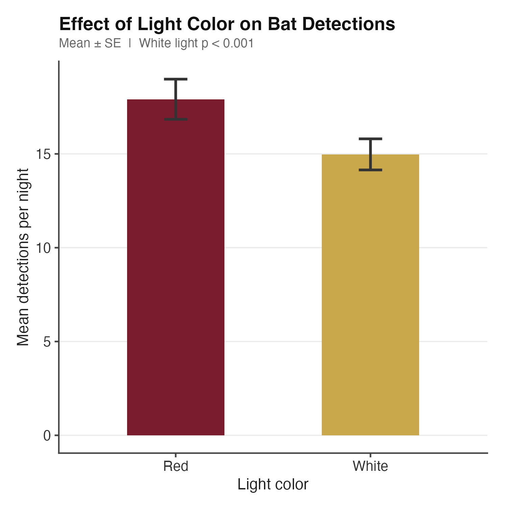
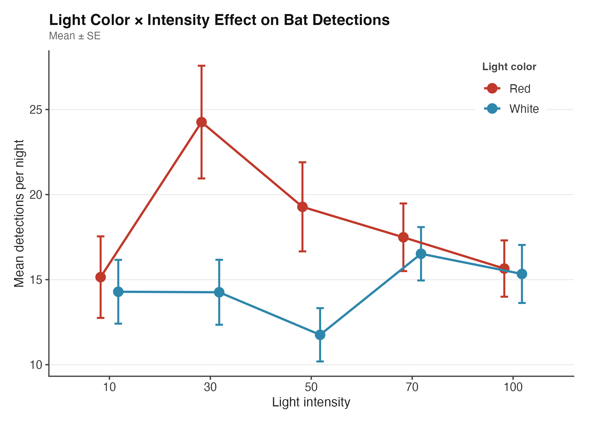
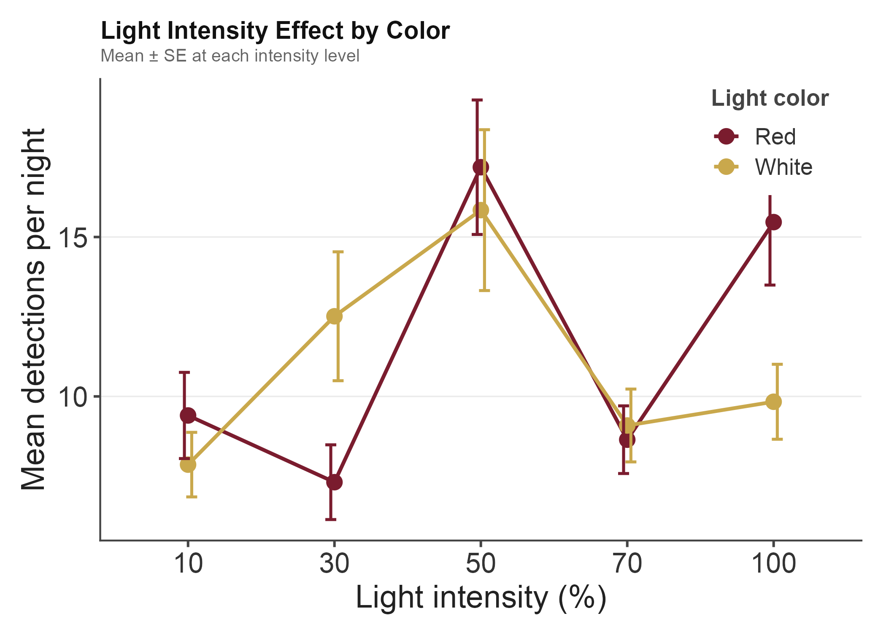
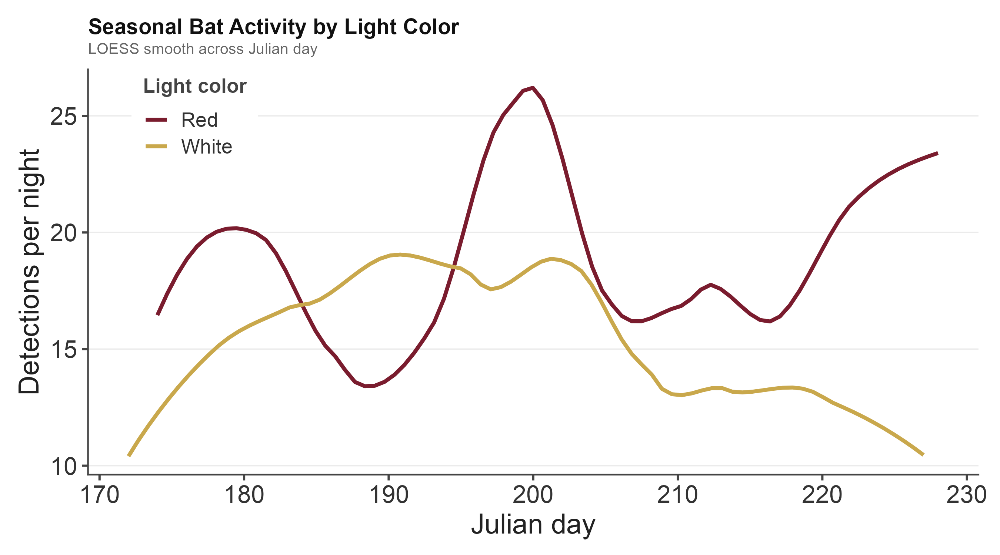
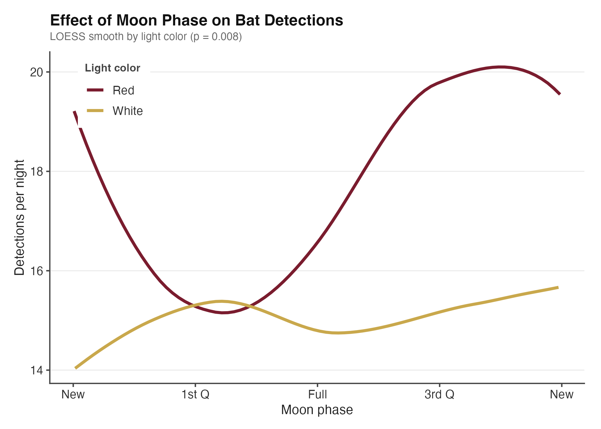
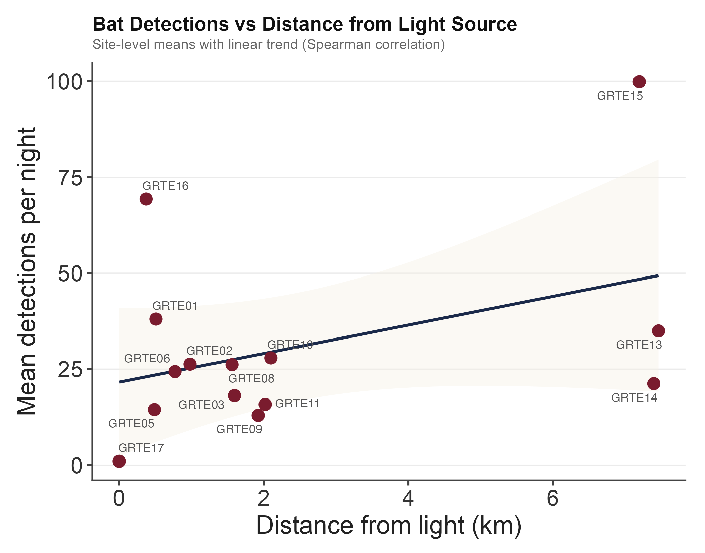
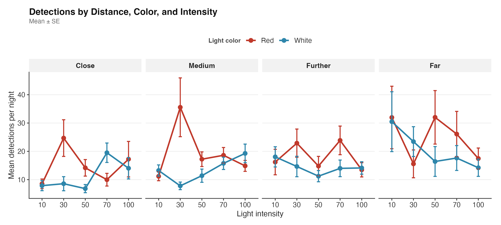
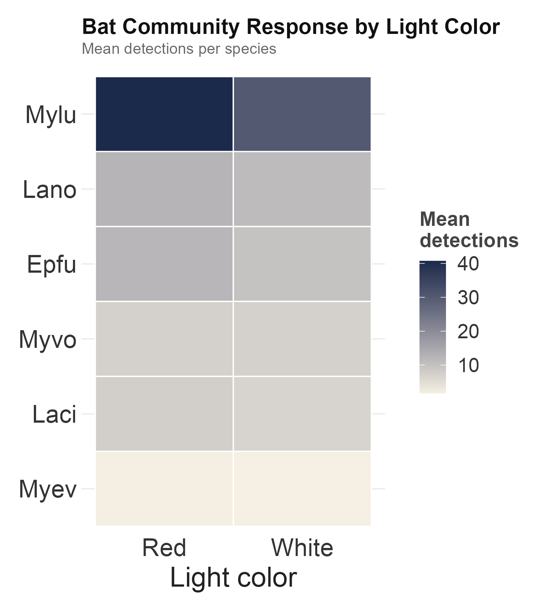
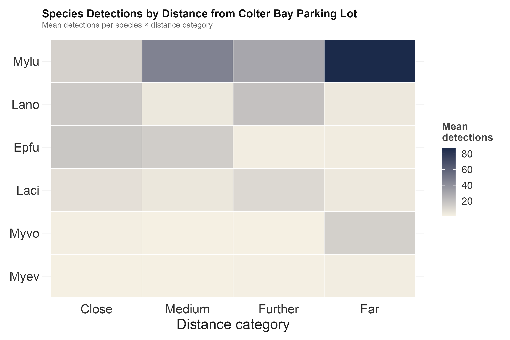
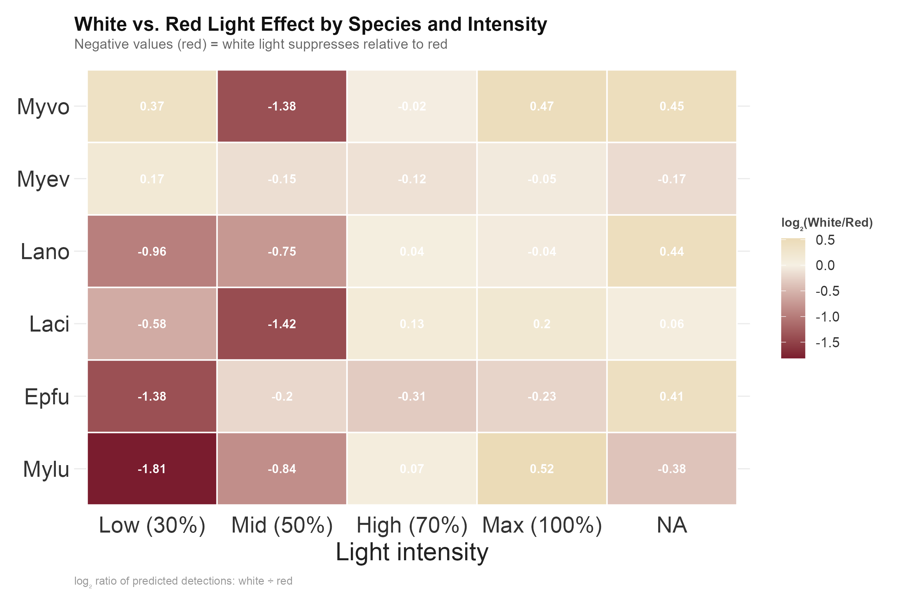

```{r setup, include=FALSE}
knitr::opts_chunk$set(echo = FALSE, warning = FALSE, message = FALSE)
```

## Overview

**Study question:** Does light colour (red vs. white) affect bat acoustic
activity, and does the answer depend on intensity or distance from the source?

**Design:** 14 acoustic monitoring stations along a distance gradient
(< 0.52 km to > 2.1 km from source), red vs. white light crossed at five
intensities (10, 30, 50, 70, 100%). Survey season: 2022. Eight focal species:
Epfu, Laci, Lano, Myev, Mylu, Myvo, Myyu, Myci.

**Colour palette:** Cardinal crimson (red light, `#7A1C2E`) · Gilded gold
(white light, `#C9A84C`) · Intensity gradient: manuscript ivory → gilded
gold → papal purple → cardinal crimson → nave navy.

---

## Primary Model

```
Family:      nbinom2  ( log )
Formula:     detections ~ color * intensity + intensity * dist_km +
             mean_phase + pct_nonforest + brightness_dark +
             jd_c + I(jd_c^2) + (1 | site)
Zero infl:   ~1
Data:        data_env

      AIC       BIC    logLik  -2*log(L)  df.resid
  24256.7   24398.1  -12105.4   24210.7      3434

Random effects:
 Groups  Name         Variance  Std.Dev.
 site    (Intercept)  0.3728    0.6106
Number of obs: 3457, groups: site, 14

Dispersion parameter for nbinom2 family (): 0.607

Conditional model:
                       Estimate   Std.Err  z value  Pr(>|z|)
(Intercept)           2.1920095  0.3045    7.199   6.05e-13  ***
colorW                0.0499199  0.0931    0.536   0.5917
intensity30           0.7155529  0.1476    4.849   1.24e-06  ***
intensity50           0.4606876  0.1569    2.936   0.0033    **
intensity70           0.6229863  0.1099    5.671   1.42e-08  ***
intensity100          0.2331022  0.1331    1.752   0.0798    .
dist_km               0.1375974  0.0675    2.040   0.0414    *
mean_phase            0.1992094  0.1171    1.701   0.0889    .
pct_nonforest         0.5326479  0.8559    0.622   0.5337
brightness_dark      -0.0262336  0.0376   -0.698   0.4854
jd_c                 -0.0073183  0.0017   -4.287   1.81e-05  ***
I(jd_c^2)            -0.0003733  0.0002   -2.150   0.0315    *
colorW:intensity30   -0.7703147  0.1751   -4.399   1.09e-05  ***
colorW:intensity50   -0.5357506  0.1459   -3.672   0.0002    ***
colorW:intensity70   -0.1550017  0.1366   -1.135   0.2565
colorW:intensity100   0.0172641  0.1353    0.128   0.8985
intensity30:dist_km  -0.0501091  0.0319   -1.572   0.1159
intensity50:dist_km  -0.0364428  0.0294   -1.239   0.2153
intensity70:dist_km  -0.1275481  0.0272   -4.687   2.77e-06  ***
intensity100:dist_km -0.0897028  0.0269   -3.335   0.0009    ***

Zero-inflation model:
            Estimate  Std.Err  z value  Pr(>|z|)
(Intercept)   -21.53   805.37   -0.027    0.979
```

Reference levels: color = R (red), intensity = 10%. Distance entered as
continuous raw km. Two 2-way interactions: color × intensity,
intensity × dist_km.

---

## Post-hoc: Colour × Intensity

Estimated marginal means on the response scale (detections/night), averaged
over distance. Holm-corrected pairwise contrasts.

```
=== Estimated marginal means: color at each intensity (response scale) ===

intensity = 10:
 color  response   SE   df  asymp.LCL  asymp.UCL
 R        12.7   2.29  Inf     8.93      18.1
 W        13.4   2.42  Inf     9.37      19.0

intensity = 30:
 color  response   SE   df  asymp.LCL  asymp.UCL
 R        23.2   4.64  Inf    15.70      34.3
 W        11.3   2.31  Inf     7.57      16.9

intensity = 50:
 color  response   SE   df  asymp.LCL  asymp.UCL
 R        18.6   3.90  Inf    12.30      28.0
 W        11.4   2.45  Inf     7.49      17.4

intensity = 70:
 color  response   SE   df  asymp.LCL  asymp.UCL
 R        17.8   3.21  Inf    12.49      25.4
 W        16.0   2.97  Inf    11.14      23.0

intensity = 100:
 color  response   SE   df  asymp.LCL  asymp.UCL
 R        13.1   2.48  Inf     9.05      19.0
 W        14.0   2.51  Inf     9.87      19.9

=== Red vs. White contrast at each intensity (Holm-corrected) ===

 intensity  ratio    SE   df  z.ratio  p.value
 10         0.951  0.089  Inf   -0.536   0.5917
 30         2.055  0.299  Inf    4.946  <0.0001  ***
 50         1.626  0.182  Inf    4.345  <0.0001  ***
 70         1.111  0.109  Inf    1.067   0.2860
 100        0.935  0.095  Inf   -0.665   0.5062

Ratio = R / W (ratio > 1 = more detections under red)
```

At 30% intensity, red light produced **2.06× more detections** than white
(p < 0.0001). At 50%, **1.63×** (p < 0.0001). At 70% and 100%, no
significant difference. White and red converge above 50% intensity.

::: {layout-ncol=2}



:::



---

## Post-hoc: Intensity within Colour

```
=== Intensity pairwise contrasts within Red (Holm-corrected) ===

 contrast         ratio    SE   df  z.ratio  p.value
 10 / 30          0.547  0.075  Inf   -4.406  0.0001  ***
 10 / 50          0.685  0.098  Inf   -2.654  0.0478  *
 10 / 70          0.714  0.066  Inf   -3.619  0.0024  **
 10 / 100         0.969  0.113  Inf   -0.272  1.0000
 30 / 50          1.251  0.192  Inf    1.457  0.4350
 30 / 70          1.305  0.182  Inf    1.912  0.2237
 30 / 100         1.771  0.231  Inf    4.387  0.0001  ***
 50 / 70          1.043  0.148  Inf    0.298  1.0000
 50 / 100         1.415  0.171  Inf    2.880  0.0278  *
 70 / 100         1.356  0.163  Inf    2.539  0.0556  .

=== Intensity pairwise contrasts within White (Holm-corrected) ===

 contrast         ratio    SE   df  z.ratio  p.value
 10 / 30          1.182  0.177  Inf    1.119  1.0000
 10 / 50          1.170  0.184  Inf    0.999  1.0000
 10 / 70          0.834  0.085  Inf   -1.778  0.6033
 10 / 100         0.952  0.096  Inf   -0.484  1.0000
 [all remaining contrasts: p >= 0.14]
```

Under red light, activity peaks at 30% (30% produces **1.83× more** than
10%; p < 0.0001) and collapses at 100% (30/100 ratio = 1.77; p < 0.0001).
50% and 70% are intermediate and not distinguishable from 30%. **White is
flat across all intensities** — no pairwise contrast survives Holm correction.

::: {layout-ncol=2}



:::

---

## Post-hoc: Intensity × Distance

Distance entered as continuous raw km. Interaction tests whether the effect
of intensity changes with distance from the source — motivated by physical
attenuation of light with distance.

```
=== Distance slope (km) by intensity level (emtrends) ===

 intensity  dist_km.trend    SE   df  asymp.LCL  asymp.UCL
 10              0.1376  0.0675  Inf    0.005      0.270  *
 30              0.0875  0.0689  Inf   -0.047      0.222
 50              0.1012  0.0676  Inf   -0.031      0.234
 70              0.0100  0.0670  Inf   -0.121      0.141
 100             0.0479  0.0669  Inf   -0.083      0.179

Slopes averaged over color levels. Positive = more detections farther from
source (recovery with distance). Only intensity 10 slope differs from zero.

=== Pairwise distance-slope contrasts (Holm-corrected) ===

 contrast              estimate    SE   df  z.ratio  p.value
 intensity10 - 70       0.1275  0.027  Inf    4.687  <0.0001  ***
 intensity10 - 100      0.0897  0.027  Inf    3.335   0.0077  **
 intensity50 - 70       0.0911  0.028  Inf    3.222   0.0102  *
 [all other contrasts: p >= 0.085]

=== Intensity contrasts at ecologically meaningful distances ===

dist_km = 0.3 km (Close):
 contrast          ratio    SE   df  z.ratio  p.value
 intensity10 / 70  0.602  0.051  Inf   -6.043  <0.0001  ***
 intensity70 / 100 1.340  0.133  Inf    2.944   0.0292  *
 [all other contrasts: p >= 0.10]

dist_km = 0.7 km (Medium):
 contrast          ratio    SE   df  z.ratio  p.value
 intensity10 / 70  0.634  0.050  Inf   -5.822  <0.0001  ***
 intensity70 / 100 1.320  0.125  Inf    2.938   0.0297  *
 [all other contrasts: p >= 0.13]

dist_km = 2.0 km (Far):
 contrast          ratio    SE   df  z.ratio  p.value
 intensity10 / 70  0.748  0.052  Inf   -4.176   0.0003  ***
 [all other contrasts: p >= 0.07]
```

The intensity × distance interaction is driven by **70% and 100%**: their
distance slopes are significantly shallower than 10% — high intensities
suppress bats uniformly across distance, not just close in. At 0.3 km,
70% produces 1.66× more detections than 10%; this gap narrows but persists
at 2.0 km (ratio = 0.748, p = 0.0003).

::: {layout-ncol=2}



:::


---

## Community Analysis

```
=== NMDS ===
Stress: 0.207  (k = 2, Bray-Curtis, trymax = 100)

=== PERMANOVA (adonis2) ===
          Df  SumOfSqs     R2      F     Pr(>F)
Model      9    3.8338  0.156  2.507   <0.001  ***
Residual 122   20.7295  0.844
Total    131   24.5633  1.000

=== Homogeneity of dispersion (by color) ===
           Df   Sum Sq   Mean Sq  F value  Pr(>F)
Groups      1  0.00014  0.000145   0.0061  0.938
Residuals 130  3.07863  0.023682

=== dbRDA marginal tests ===
                Df  SumOfSqs     F    Pr(>F)
color            1    0.2421  1.425   0.193
intensity        4    1.1300  1.663   0.048  *
dist_km          1    1.2271  7.222  <0.001  ***
mean_phase       1    0.2509  1.477   0.184
pct_nonforest    1    0.6241  3.673   0.007  **
brightness_dark  1    0.5661  3.332   0.012  *
Residual       122   20.7295

=== mvabund — multivariate GLM (nBoot = 9999) ===
                Dev   Df  Pr(>Dev)
color           9.22   1   0.415
intensity      83.52   4   0.002   **
dist_km       142.57   1  <2e-16   ***
mean_phase     24.59   1   0.016   *
pct_nonforest  40.16   1   0.001   ***
brightness_d   54.29   1  <2e-16   ***
```

**Colour does not restructure community composition** (dbRDA p = 0.193,
mvabund p = 0.415). **Distance is the dominant structuring variable**
(dbRDA F = 7.22, p < 0.001; mvabund Dev = 142.6, p < 0.001). Intensity
marginally significant in both analyses. Habitat and sky brightness also
contribute. Dispersion homogeneous between colour treatments (p = 0.938) —
PERMANOVA result reflects centroid location, not spread.



---

## Species-level Results

```
=== mvabund univariate p-values (adjusted, PIT-trap 9999 iter) ===

Species  Colour  Intensity  Distance  Moon phase  %nonforest  brightness
Epfu     ns      ***        **        *           ns          ns
Laci     ns      ns         **        ns          ns          ns
Lano     ns      ns         **        ns          ns          ns
Myev     ns      ns         ***       ns          **          ns
Mylu     ns      ns         *         ns          ns          ns
Myvo     ns      ns         ***       ns          *           ***
Myyu     ns      ns         ns        ns          ns          ns
Myci     ns      ns         ns        ns          ns          ns
```

**Epfu:** most treatment-sensitive; responds to intensity, distance, and moon
phase. **Myev:** tracks habitat (pct_nonforest) and distance. **Myvo:**
strongly tracks sky brightness and distance. **Myyu, Myci:** no significant
response to any measured predictor. Colour is non-significant for all species.



::: {layout-ncol=2}



:::

---

## Summary

1. **Colour × intensity:** Red light at 30–50% produced 1.6–2.1× more
   detections than white. At 70% and 100%, colours converge. White light
   is flat across all intensities.

2. **Intensity × distance:** 70% and 100% intensities show significantly
   shallower distance-recovery slopes than 10% — high intensities suppress
   bats uniformly across distance, not just close in. The 70% vs. 10% gap
   at 0.3 km (1.66×) persists at 2.0 km (ratio = 0.748, p = 0.0003).

3. **Community composition** is driven by distance, habitat (pct_nonforest),
   and sky darkness — not by light colour.

4. **Management implication:** Red light at 30–50% intensity minimises
   suppression of bat activity. At high intensities, siting lights > 0.5–1.0
   km from sensitive habitat is critical to reduce impact.

---

## Species Key

| Code | Species | Common name |
|------|---------|-------------|
| Epfu | *Eptesicus fuscus* | Big brown bat |
| Laci | *Lasiurus cinereus* | Hoary bat |
| Lano | *Lasionycteris noctivagans* | Silver-haired bat |
| Myci | *Myotis ciliolabrum* | Western small-footed myotis |
| Myev | *Myotis evotis* | Long-eared myotis |
| Mylu | *Myotis lucifugus* | Little brown myotis |
| Myvo | *Myotis volans* | Long-legged myotis |
| Myyu | *Myotis yumanensis* | Yuma myotis |
